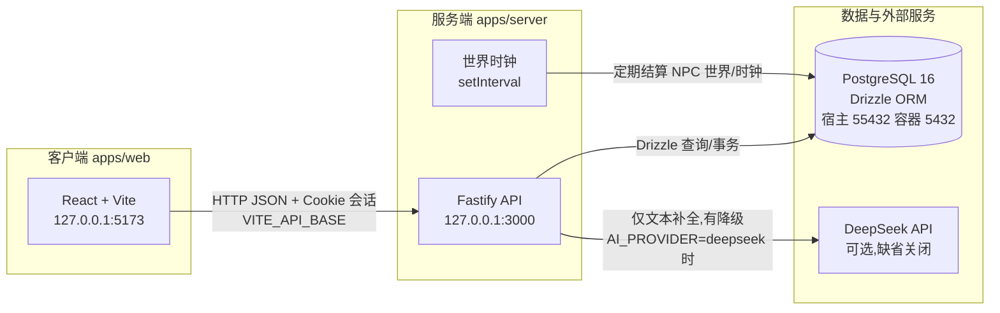
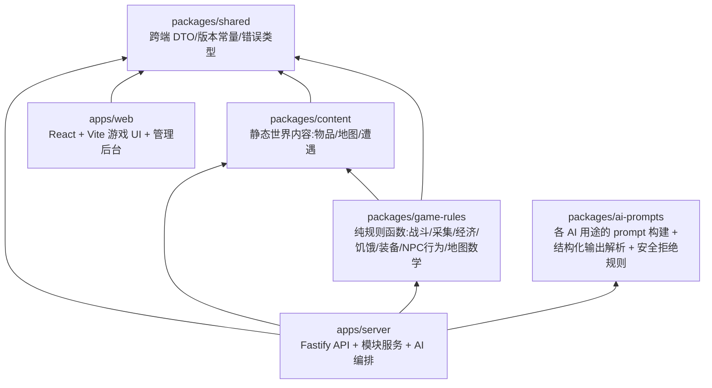
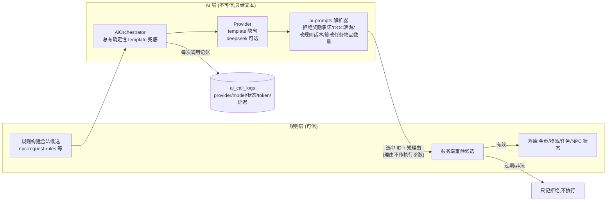
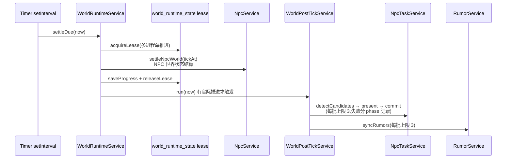
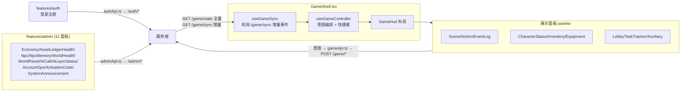
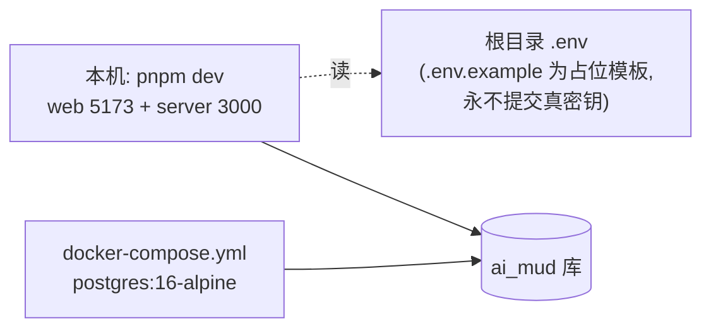

# AI MUD 项目架构图（v0.10.6）

本文档是项目的系统级架构总览：一次讲清前端 → 服务端 → 规则层 → AI 层 → 数据库之间的数据流和模块关系。
所有内容均从当前代码核对而来；历史版本的过程性设计见 `docs/superpowers/specs/`，各版本变更见 `docs/releases/`。

> 说明：`docs/superpowers/` 是历史设计/计划文档目录（179 个文件），与已下线的 superpowers skill 无关，仍是有效的架构参考资料。
> 另注意：早期设计文档提到“服务端通过 WebSocket 推送结果”，但**当前实际实现没有 WebSocket**，
> 客户端通过 HTTP 轮询 `/game/sync` 获取增量事件（见第 5 节）。

---

## 1. 系统全景

- 单体优先：一个服务端应用承载全部游戏逻辑，内部按领域模块拆分，不拆微服务。
- 服务端是唯一权威状态源：客户端只提交玩家意图，所有数值结算都在服务端完成。
- 本地启动：`pnpm db:up`（Docker 起 Postgres）→ `pnpm db:migrate` → `pnpm dev`（双端）。

---

## 2. Monorepo 依赖关系

构建顺序：`shared` → `content` → `game-rules` → `ai-prompts` → `server` / `web`。

依赖纪律（`CLAUDE.md`  load-bearing 规则）：

- `game-rules` 和 `content` **无副作用、无 DB 访问**，是纯函数；凡是决定数值结果（伤害、掉落、价格、耐久、饥饿）的一律归这里，不许写在 service 里。
- 版本唯一事实源是 `packages/shared/src/version.ts`（当前 `PRODUCT_VERSION = 0.10.6`，
  兼容块 `schemaVersion 25 / apiVersion 39 / engineVersion 2 / rulesetVersion 16 / contentVersion 12 / promptVersion 8 / economyVersion 4 / worldSeedVersion 1`）；
  根 `package.json` 的 version 字段滞后，不可信。改动对应领域必须 bump 对应子版本（新迁移 → `schemaVersion`，新路由契约 → `apiVersion`，新 prompt → `promptVersion`……），有测试断言这些常量。

---

## 3. 服务端：请求链（三层模块模式）

每个 `apps/server/src/modules/<name>/` 遵循：

`*.repository.ts`（Drizzle 查询）→ `*.service.ts`（业务逻辑，框架无关，构造器注入 repo）
→ `*.routes.ts`（Fastify 路由注册 + zod 校验 + 会话/鉴权检查）

```mermaid
flowchart LR
    subgraph Routes["路由层 (*.routes.ts),仅 3 个路由文件"]
        AUTH_R["auth.routes<br/>/auth/register/login/logout/me"]
        GAME_R["game.routes<br/>/game/* 约 25 个端点"]
        ADMIN_R["admin.routes<br/>/admin/* 约 14 个端点"]
    end
    subgraph Services["服务层 (*.service.ts),框架无关"]
        GAME_S["GameService<br/>玩法主循环"]
        NPC_S["NpcService<br/>NPC 模拟"]
        TASK_S["NpcTaskService<br/>任务托管"]
        MEM_S["NpcMemoryService<br/>记忆"]
        DLG_S["DialogueService<br/>对话+资源转移"]
        RUMOR_S["RumorService<br/>传闻"]
        ITEM_S["ItemService<br/>物品装备"]
        LEDGER_S["LedgerService<br/>铜币/物品账本"]
        LOBBY_S["LobbyService<br/>大厅聊天"]
        OFF_S["OfflineReportService<br/>离线报告"]
        ANN_S["AnnouncementService<br/>系统公告"]
        RT_S["WorldRuntimeService<br/>世界时钟"]
        RESET_S["WorldResetService<br/>世界重置"]
        ACCT_S["AccountOps/ActivationCode<br/>账号运维/激活码"]
        AIGOV["AiGovernanceService<br/>AI 调用治理"]
    end
    subgraph Repos["仓储层 (*.repository.ts)"]
        REPO["Drizzle Repository<br/>逐模块"]
    end
    subgraph Pure["纯层 packages"]
        GR["game-rules"]
        CT["content"]
    end

    AUTH_R --> Services
    GAME_R --> Services
    ADMIN_R --> Services
    Services --> REPO
    Services --> GR
    Services --> CT
    REPO --> PG[("PostgreSQL")]
```

- `app.ts` 装配一切：`buildApp()` 注册 cookie（`SESSION_SECRET` 签名会话）→ CORS → 三组路由 → `/health`；
  写操作路由要求 `x-csrf-token` 头（`auth.verifyCsrfToken`）。
- 限流：`InMemoryRateLimitService` 目前只用在 `auth.routes`（登录/注册防刷）。
- 管理员冷启动：`AdminBootstrapService` 用 `ADMIN_BOOTSTRAP_EMAIL/PASSWORD` 建首个管理员账号。
- 服务单测约定：用内存 fake 仓储测 service，不连真库（范式见 `ai-layer-boundary.test.ts`）。

### 3.1 对外端点一览

| 前缀 | 端点（节选） | 说明 |
|---|---|---|
| `/auth` | `POST register/login/logout`，`GET me` | Cookie 会话 + CSRF |
| `/game` | `GET state` / `GET sync` | 全量状态 / 增量事件（客户端轮询） |
| `/game` | `POST characters/enter-zone/move/gather/combat/start/action/cancel/return-village/eat` | 探索、采集、自动战斗、进食等主循环 |
| `/game` | `GET+POST market/buy/sell`，`POST repair(/quote//all)`，`POST equipment/equip` | 集市交易、修理、装备 |
| `/game` | `GET/POST npcs/:id/dialogue`，`POST npc-tasks/:id/accept/complete`，`POST chat/presence/heartbeat`，`POST relief/claim` | NPC 对话、任务、大厅聊天、在线心跳、救济金 |
| `/admin` | `GET accounts/economy/asset-ledger/health/npcs/world-runtime/ai-calls/ai-layer/status/npc-memory/activation-codes`（18 个端点，读多写少） | 运营可观测 |
| `/admin` | `POST npcs/settle/npcs/simulate/announcements/activation-codes/.../revoke/accounts/.../disable/restore/revoke-sessions/world-reset` | 运营操作 |
| `/health` | `GET` | 存活探针 |

---

## 4. AI 层边界（本仓库最重要的架构规则）

**规则系统拥有全部世界状态；AI 只许产出文本。**

- 6 种 AI 用途在 `ai-purpose-policy.ts` 声明，全部 `mutatesWorldState: false`、`fallbackRequired: true`，
  由 `ai-layer-boundary.test.ts` 回归锁定：`npc_dialogue`、`npc_task_copy`、`npc_memory_compression`、
  `world_rumor`、`npc_task_proposal`、`offline_summary`。
- 金币/物品/经验/装备/任务奖励/NPC 与世界状态，只由规则层服务写入。
- 新增 AI 用途必须配齐：policy 条目 + fallback + `ai_call_logs` 写路径 + 边界测试
  （清单见 `docs/superpowers/specs/2026-07-02-v0.6-ai-layer-closeout-checklist.md`）。
- AI 治理：`AiGovernanceService` 汇总 `ai_call_logs`，供管理后台“AI 状态”面板展示。
- NPC 任务闭环示例（`npc-task.service.ts` + `game.composition.ts`）：真实 NPC 需求（缺矿/饥饿）→
  规则组装候选任务并确认 NPC 钱包可托管奖励 → AI 只润色标题/描述/理由 → 提交时重读 NPC 与库存、
  过期/变化则拒绝 → 完成时物品进 NPC 背包、托管金币支付玩家，过期任务退托管。

---

## 5. 世界时钟（World Tick，后台推进）

- `createWorldRuntimeScheduler` 保证单进程内同一次结算不重入（`settlementInFlight`/`postTickInFlight`）。
- `WORLD_TICK_MAX_STEPS` 限单次最大步数；`WORLD_TICK_ENABLED=false` 可关闭后台推进。
- 离线不做高频模拟，按时间差批量结算（设计见游戏设计文档第 3 章 World Clock）。

---

## 6. 客户端（apps/web）

- 客户端不存权威状态：展示 + 提交意图；可做预测性 UI，但预测不当真。
- 输入：快捷键（`W/A/S/D` 移动等）+ NPC 自由对话输入框 + 大厅聊天输入框（见 `features/game/input/`）。
- `API_BASE = VITE_API_BASE ?? http://127.0.0.1:3000`，`credentials: include` 带 Cookie。

---

## 7. 数据模型（PostgreSQL，Drizzle，25 个迁移，33 张表）

`apps/server/src/db/schema.ts`，按领域分组：

```mermaid
flowchart TB
    subgraph Acct["账号与会话"]
        accounts
        sessions
        activationCodes["activation_codes"]
        auditLogs["audit_logs"]
    end
    subgraph Char["角色与玩法"]
        characters
        characterPresence["character_presence"]
        characterItems["character_items"]
        characterEquipment["character_equipment"]
        characterActions["character_actions"]
        chatMessages["chat_messages"]
        gameEvents["game_events"]
        syncEvents["sync_events"]
    end
    subgraph Asset["资产账本与市场"]
        itemInstances["item_instances"]
        itemLedger["item_ledger"]
        assetLedger["asset_ledger"]
        marketInventory["market_inventory"]
        marketTransactions["market_transactions"]
        municipalTreasury["municipal_treasury"]
    end
    subgraph World["NPC 世界"]
        worldActors["world_actors"]
        npcItems["npc_items"]
        npcActions["npc_actions"]
        npcEvents["npc_events"]
        worldResourceNodes["world_resource_nodes"]
        worldRuntimeState["world_runtime_state"]
        mapInstances["map_instances"]
        systemAnnouncements["system_announcements"]
    end
    subgraph AIC ["AI 层"]
        aiCallLogs["ai_call_logs"]
        worldRumors["world_rumors"]
        npcDialogueMessages["npc_dialogue_messages"]
        npcRelationships["npc_relationships"]
        npcMemoryEntries["npc_memory_entries"]
        npcMemoryFragments["npc_memory_fragments"]
        npcTasks["npc_tasks"]
    end

    characters --> accounts
    characterItems --> characters
    characterEquipment --> characters
    syncEvents --> characters
    itemLedger --> itemInstances
    assetLedger --> accounts
    npcTasks --> worldActors
    npcMemoryEntries --> worldActors
    aiCallLogs -. 审计 .-> AIC
```

- 资产双账本：铜币走 `asset_ledger`（`LedgerService`），物品实例流转走 `item_ledger`；管理后台有账本健康面板。
- `world_runtime_state` 存时钟进度 + 推进租约；`sync_events` 是客户端增量同步的事件源。
- 迁移纪律：新迁移文件由 `drizzle-kit` 生成（`db:generate`/`db:migrate`），有迁移链校验测试
  （`migration-journal.test.ts`）和真库集成测试（`postgres-integration.test.ts`）。

---

## 8. 部署与配置

关键环境变量（`apps/server/src/config/env.ts`，zod 校验）：

- `DATABASE_URL`（必填）、`SESSION_SECRET`（≥32 字符）。
- 世界时钟：`WORLD_TICK_ENABLED`、`WORLD_TICK_INTERVAL_MS`（缺省 60s）、`WORLD_TICK_MAX_STEPS`（缺省 60）。
- AI：`AI_PROVIDER=template|deepseek`（缺省 template，零 key 全确定性运行）、`DEEPSEEK_API_KEY/BASE_URL/MODEL`、
  `AI_NPC_DIALOGUE_ENABLED`、`AI_DIALOGUE_TIMEOUT_MS`（缺省 8s）、`AI_DIALOGUE_MAX_OUTPUT_TOKENS`。
- 启动：`ADMIN_BOOTSTRAP_EMAIL/PASSWORD`、`WEB_ORIGINS`（CORS 白名单）。

---

## 9. 一句话总结

React 客户端只管展示与意图 → Fastify 三层模块（路由/服务/仓储）裁决一切 →
纯函数规则包算数值、静态内容包给事实 → AI 永远只写文本且有 template 兜底 →
Postgres 存全量状态，世界时钟在后台用租约单步推进 NPC 世界。
