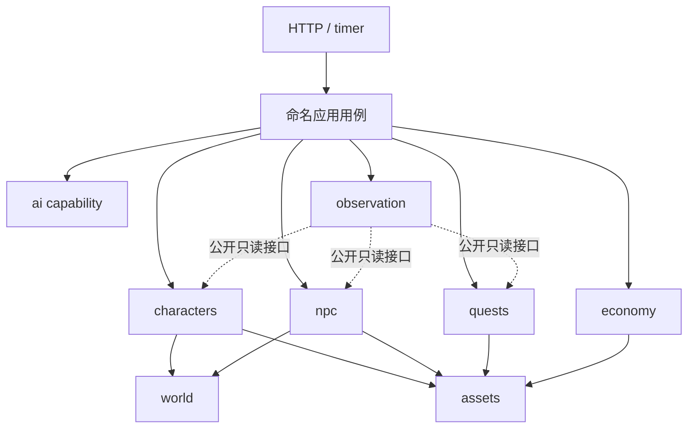

# 模块化合同：公开能力、数据归属与扩展边界

版本 3.0 / 2026-09-18；状态 PROPOSED，未实施。源码基线 `690cbc816051b30e323bb005c93c1396e1303c3c`。本文把 target.md 的“模块化单体”细化为可检查的合同；不代表已有代码已符合，也不授权立即重构。

## 1. 决定：模块化单体，不是目录化单体，也不是微服务

模块具有：单一业务责任、明确拥有的状态、最小公开接口、允许依赖、失败语义、合同测试和退出方案。放进 modules/ 并不能证明这些成立。分层解决“技术代码放哪”，业务模块解决“某种事实归谁”。两者都要有。

运行形态仍是一套 Node/Fastify 应用、一个 PostgreSQL、React 客户端。内部 API 默认是类型化的进程内函数/接口，不走 localhost HTTP，不部署一模块一服务。未来拆服务是新的决策，涉及延迟、独立发布和事务语义，不能把本地函数换成 HTTP 就声称完成。

## 2. 业务模块目录（逻辑边界，非立即创建的目录）

| ID | 负责的事实/行为 | 当前来源与收敛方向 | 公开能力示例 |
|---|---|---|---|
| identity | 账号、会话、角色权限、激活与账号运维 | auth/account-ops/activation-code | 验证主体、撤销会话；不裁决金币 |
| world | 区域/实例、逻辑位置、资源节点、世界进度/epoch | world-runtime 的状态部分、map/world-reset 的领域部分 | 查通行与作用域、锁定并推进一个 tick 的进度 |
| characters | 玩家角色、生命、成长、个人行动与按需结算 | game.service 中的角色/战斗/采集部分 | 角色快照、开始/结算行动；不绕过 assets 改库存 |
| assets | 铜币、堆叠物品、装备实例、可支配量/预留、资产账本 | item + ledger + 分散的资产 SQL | 转移/消耗/发放/托管结算；不知道“补给剧情” |
| economy | 市场报价、库存目标、成交记录、生产配方的经济规则 | game 中的市场路径、npc 中重复的买卖编排 | 报价与合法成交；实际库存和款项调用 assets |
| npc | NPC 身份/需求/位置引用/目标/行动/关系/可信经历/对话 | npc/npc-memory/dialogue | 观察、合法目标与交涉候选、行动、记录履约；不持有任意模型工具 |
| quests | 需求任务与已接受义务的状态、履约条件、过期 | npc-task；后续小剧情优先作为任务内容 | 建立/接受/完成/取消任务；资产托管经过 assets |
| social | 大厅聊天、在线状态、公告与公开传播 | lobby/announcement；rumor 的公开发布部分 | 带受众的聊天/公告/传闻读取与发布 |

这是八个逻辑业务边界，不要求拆成八个 workspace，也不要求同时改名所有当前文件。职责清单明确后，优先提取正在变更的路径。不要预创建公会、住宅、拍卖、天气等空模块。

辅助边界不是万能业务模块：

- `ai`：模型适配、输入输出验证、预算、调用审计；Decision/Narrative 两类能力。没有世界数据库写能力。
- `observation`：聚合公开 Query API 和格式化文本/场景；不运行模型，不结算，不维护第二份余额。
- `application`：命名跨域用例和世界调度，例如 complete-task、market-trade、advance-world-tick。只协调，不复制定价、人格或伤害公式。
- `platform`：Db/UoW、时钟、日志、配置、取消与少量持久交付设施；不认识某个 NPC 或剧情 ID。
- `transport`：HTTP/鉴权适配、协议校验/映射；不得拿全局 db 绕过用例。
- `composition`：唯一装配入口，可创建模块并注入依赖；不能被业务模块反向 import。

运行时世界 tick 的协调属于 application，world 只拥有时间进度和空间/资源事实。禁止因为现在文件叫 world-runtime，就把 NPC、市场、任务和 AI 的所有逻辑继续塞进一个 WorldManager。

## 3. 内部 API 与依赖图

规范性允许边见 `module-catalog.json`。配置描述目标逻辑图，不是当前源码扫描结果。除公共 kernel/content/rules 外，业务依赖初始仅允许：characters→world/assets；npc→world/assets；economy→assets；quests→assets。未列出的跨业务边默认禁止。

例如 npc 与 quests 互相影响，不能做 npc.service → quest.repository → npc.service。让 application 的 supply/complete-task 用例依次调用双方公开 API。npc 不直接依赖 ai；应用在事务外请求 ai，再把受限选择交给 npc 校验和执行。这样具体供应商、模型网络和 NPC 世界事实分离。



图仅示关键边；完整允许图以 catalog 为准。业务模块不依赖 application、transport、React、Phaser 或其他模块的 internal。type-only import 也是依赖，不得用类型循环或依赖注入回调隐藏语义循环。

边界门禁同时检查构建依赖和显式运行时依赖声明。Composition 虽能装配多个模块，也不能把被禁止的 A→B 引用偷偷注入 A。跨域行为应是命名用例，不是通过 getService(name)、万能事件总线、callback 或 any 绕过图。

## 4. 公开入口与模块内部结构

对已经提取的模块使用一个明确的 `public.ts`：只导出公开类型、错误、查询/事务参与接口。`bootstrap.ts` 仅供 composition 的固定装配清单使用；可创建实现，不能被其他业务模块或 platform import。同一文件不要既是公开合同又导出仓储。

```text
modules/<logical-module>/
  public.ts                  # 边界，不做 export * from internal
  bootstrap.ts               # 仅composition装配，不是业务API
  internal/                  # 只有本模块可读
    ...domain/application...
    persistence/             # 只有这里可用该模块的数据访问
  tests/                     # 本模块白盒测试与公开合同测试
```

这是提取完成后的结构示意，不要求旧路径一次搬迁；过渡期用精确文件归属表映射相同边界。允许模块内只有少量文件，不为对称而造空层或通用 BaseRepository。

公开 API 返回不可变快照/值对象、稳定 ID、枚举错误和必要 revision。禁止暴露 Drizzle row/query builder、数据库连接、ORM 推导类型、可被外部修改的 NPC 对象，以及可任意更新字段的 updateAnything/executeSql。

共享包仅保留真正共用的值类型/协议。server-only 模块的全部私有类型不能搬到 shared 来绕过检查；前端不应因此获得世界秘密、provider 密钥或隐藏掉率。协议 DTO 与领域值类型分开。

接口新增字段可有明确默认；破坏性改动必须列消费者、兼容窗口和迁移顺序。内部单仓接口可同 PR 协同升级，不要求所有模块独立 semver/发布；外部协议与持久化 payload 必须明确版本。

## 5. 三种跨模块通信，分别使用

| 场景 | 机制 | 失败合同 |
|---|---|---|
| 判断当前能否通行、读 NPC 公开状态、报价 | 本地 Query API | 返回有作用域/revision 的值；不能拿缓存当提交事实 |
| 交任务、交易、修理、兑换 | 同一外层 UoW 中的模块 Command API | 全部成功或全部回滚；命令 ID 去重 |
| 更新非关键索引、生成传闻措辞、外部分析 | 提交后事件/可重建投影 | 明确是否可丢/如何重建；持久需要则同事务入待处理记录并幂等消费 |

不能所有地方都用事件：钱已付、任务未完成不是可以随意接受的最终一致性。也不能所有地方同步串联：关键命令不应等待传闻模型或通知消费者完成。

事件语义使用过去式事实（task.completed），命令使用明确动词（completeTask）。订阅清单写明生产者、消费者、payload 版本、受众、是否允许重复/乱序、重试上限。消费者的新动作产生新的 commandId/causationId，并有终止条件；不能无限反向触发同一事实。事件去重键不能只有 actorId+eventType，否则会吞掉第二次真实动作。

事件合同属于生产者public API；消费仍遵守catalog。没有直接依赖许可时，由application的明确事件适配器转换为消费者public输入；不通过shared大合集或字符串总线隐藏依赖。正常世界因果反馈可以跨时间循环，但每次处理必须有状态条件、幂等和工作量上限。

本轮不引入 Kafka/Redis/通用消息总线。现有结构化事实能重建的非关键投影可轮询重建；确需可靠后台交付时才增加最小 PostgreSQL 待处理记录/消费进度，业务提交与待处理记录同事务。不能用内存 EventEmitter 或 bigserial 最大 ID 宣称可靠交付，也不承诺外部副作用 exactly-once。

## 6. 同一个事务，不允许破坏模块封装

外层命名用例启动 UoW；UoW 提供已经绑定同一真实事务的模块 API，不把裸 tx/SQL 暴露给用例或业务规则。底层 module persistence 使用 tx，不自行提交。跨模块写不经 HTTP，不用分布式事务。

platform底层事务执行器仅知道事务生命周期。composition用闭包将同一tx绑定到各域bootstrap适配；每个application用例的ports类型只引用所需public API。platform不得为实现“统一UoW”反向import业务类型，application也不得通过绑定过程获取raw tx。

以下为设计伪代码，不是现有 SDK：

```ts
return uow.run(commandScope, async (ports) => {
  // 所有方法绑定同一事务；锁定、幂等和授权按共享合同先完成。
  const obligation = await ports.quests.validateCompletion(request);
  await ports.assets.settleObligation(obligation.assetPlan);
  await ports.quests.markCompleted(obligation.id);
  await ports.npc.recordVerifiedFulfillment(obligation.verifiedFact);
  return { taskId: obligation.id, status: 'completed' };
});
```

一个用例只获取自己声明的 participant API。没有服务定位器和任意 tx.execute 逃生口。资产模块的纯入账/扣减方法也不能自行承诺任务完成。

锁计划必须包含跨模块所有实际根，按统一顺序获得。world tick 先 world runtime 根，再按统一序锁 NPC/角色/资产等参与根；普通交易禁止后拿 world runtime 锁。提交阶段发现新增未锁根应回滚、重建计划后有界重试，不能随便追加一个倒序锁。具体表/列/锁强度的映射在 ARCH-01 清单和 ARCH-03 中验证，模板并不自动证明无死锁。

命令上下文中的主体、权限、世界 epoch 由服务端构建；客户端只能提交意图，不能自报 admin/NPC 权限。相同主体、kind、commandId、epoch 相同请求返回原结果，不同 payload 冲突。模型失效/重试也不能重新制造命令 ID 造成二次赠予。

## 7. 数据封装：按事实所有者，不按“谁拿得到表”

同一 PostgreSQL 不等于任何模块都能访问任何表。常规读写通过所有者 public API；只有模块自身 persistence 能访问它拥有的存储。禁止 peer repository import 和跨域临时 JOIN。

当前同一行内混有不同事实，所以暂时按列归属，而非立刻拆全部表：

| 存储事实 | 目标写入所有者 | 特别限制 |
|---|---|---|
| characters 的 HP/XP/行动位置 | characters | 禁止顺便 set copperBalance |
| characters/world_actors 的铜币列 | assets | 不能顺便 set HP/人格/位置 |
| world_actors 的 NPC 行动/需求字段 | npc | 铜币、物品走 assets |
| character_items/npc_items/装备实例 | assets | 不允许各模块直接增减；装备只保留一个权威表示 |
| market_inventory 的 quantity | assets | economy 拥有价格/目标库存政策及成交语义，不直接改 quantity |
| municipal_treasury / 资产预留金额 / 铜币物品账本 | assets | 初始化/系统注入也必须记来源 |
| npc_tasks 的任务状态/需求条件 | quests | 现存 escrow 金额由 assets 的托管适配处理；不得双记一个钱包 |
| NPC 关系/可信履约/记忆事实 | npc | 文本压缩是可重建派生，不写入实际资产 |
| world runtime/epoch/资源池/实例 | world | 个人探险与共享资源池的 scope 不混用 |

初始行创建时，身份所有者可以写经批准的零余额等 schema 默认值；非零起始资产必须在同一用例调用 assets 建账。删除有余额/装备/托管的 actor 必须先由 assets 处理，不允许靠 cascade 无账清除。跨列对象更新使用显式字段白名单，禁止 set(snapshot) 或拼接任意 JSON。

Schema 定义文件可暂时共置；这不是给所有模块开放 SQL 的理由。新增表优先明确单一所有者。若跨列保护不断复杂化，再以迁移提案分离 wallet；现在不为了目录整齐一次拆全库。

Observation 默认聚合批量 Query API，避免 N+1。确有测量证明需跨域 JOIN，可由所有者共同维护只读 view/投影合同，注册列白名单和授权测试；仅 observation 的只读适配器可消费。它不是回写通道，不能用于需要最新锁定事实的资产裁决。

事务根锁/外键检查可能读取其他模块的标识，由 platform 的受限锁适配完成，不返回其他模块完整数据。schema/migration/维护脚本是精确、审查过的基础设施例外，不是模块任意写库的豁免。

## 8. 内容与功能怎样增长

新增物品/配方/地图/人物参数优先是 content 数据，而不是新 if 分支。只使用已支持的效果枚举和 schema，引用 ID/资源可达性/数值范围应测试。真正新的行为，例如新状态效果，才扩展所属规则和合同，不能偷偷在 content 中嵌 JS/Lua 执行。

增加 crafting 的例子：先判断现有 economy 生产能力是否足够；确需独立工单生命周期才建 crafting 模块。它拥有工单/配方版本/进度，输入材料、输出装备、预留和撤销都走 assets；NPC 提供意愿时由 application 协调。战斗和 NPC 仓储不应 import crafting.internal。新物品影响战斗可走已有合法属性/效果数据，未知效果要明示不支持。

增加天气的例子：先作为 world 的已验证环境状态；规则读取 WeatherSnapshot，不在战斗/采集/对白各造一个随机天气器。需求足够独立后才提取模块。新模块不是每个新名词一个目录。

“可移除”不等于直接删目录：先关闭新建入口，清理在途行为、托管、预留和持久引用，保留旧存档读取/迁移，再移除调用与数据。具体协议见 project-constitution.md 和 change-spec-template.md。

运行时不加载第三方任意代码。进程内 API/TypeScript 边界防止工程误用，不是对恶意插件的安全沙箱。若未来开放模组，需要另评估隔离进程/WASM、能力授权与资源限制，不得把目前边界宣传成沙箱。

## 9. 扩展和拆服务的证据门槛

支持更复杂机制不等于今天承诺更多并发。记录 command/查询延迟、tick 积压、SQL 数量/锁等待、模型等待与费用。先做批量读取/索引/有限调度，CPU 瓶颈有证据再考虑 worker；独立扩缩、故障隔离或团队发布确有需要才拆服务。

如果两个模块每次修改都一起变，或必须双向同步访问内部细节，先评估合并或重划边界，不能只叠接口。反之，一个接口承担大量不相干调用，需按职责拆公开能力。接口不是越多越好，而是把变化限制在应该变化的地方。

## 10. 来源与核对范围

源码结构依据：固定基线的 game.service.ts、game.repository.ts、npc.service.ts、npc-task.repository.ts、dialogue-resource-transfer.repository.ts、item.service.ts、app.ts、shared/game.ts；详细源码发现见 2026-09-18-review.md。以上目标是本项目设计取舍，不是第三方保证。

外部机制（2026-09-18读取官方文档）：
- Node exports 收敛包子路径，但不是强封装：https://nodejs.org/api/packages.html
- Fastify encapsulation 作用于插件上下文，不自动限制 TS import/SQL：https://fastify.dev/docs/latest/Reference/Encapsulation/
- TypeScript project references 帮助构建与项目分组，不替代数据归属/业务边界测试：https://www.typescriptlang.org/docs/handbook/project-references
- PostgreSQL 锁序与事务：https://www.postgresql.org/docs/current/explicit-locking.html

本轮没有安装依赖、实现 public API、运行边界扫描/PG/E2E 或验证模型。门禁落地见 modularity-baseline.md。
