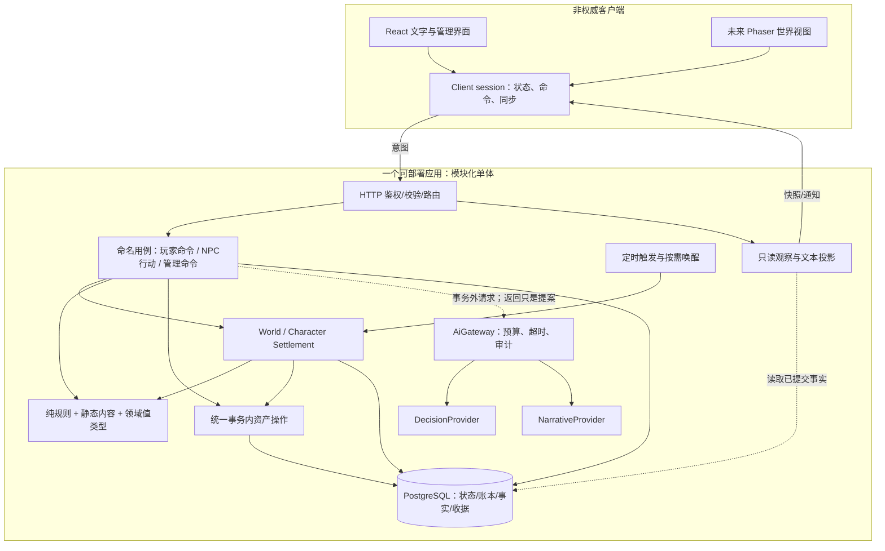
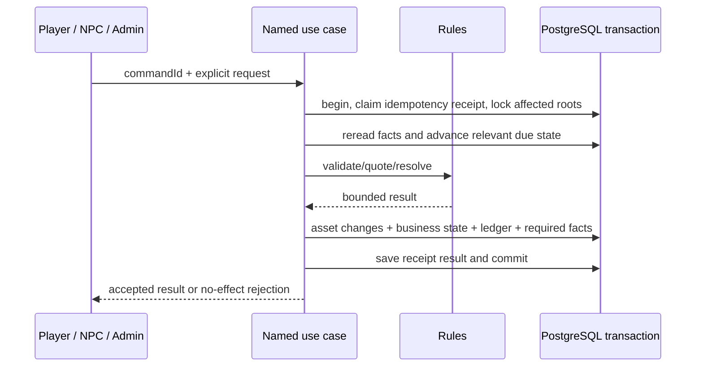

# AI MUD 目标架构：小型、服务端权威、可替换表现

版本：2.0 / 2026-09-18。状态：PROPOSED，未实施。基线：`690cbc8` / 产品 `0.10.6`。本文高于旧版本包的架构约束，但合并文档不授权自动开发。

## 1. 为哪一种游戏设计

默认形态：浏览器在线、一个共享小镇、个人探险实例、格子移动、自动战斗、持续NPC生活、低频语义判断。近期验收以现有4个NPC、小规模受邀玩家为目标，不承诺未测的并发容量。

未来像素版默认只是改善观察和交互，不自动变成实时物理战斗，也不自动变成离线单机。共享野外/碰撞战斗/离线本地权威都是独立产品决策，改变时重新评审相关边界。

目标不是“最完整的AI游戏引擎”，而是新增一个玩法时不必重新发明结算、资产、记忆与同步。

## 2. 目标全景（不是当前实现）



图中的Cases不是一个泛化CommandBus，Runtime不是第二套工作流引擎。它们是现有服务中应抽出的明确职责和少量函数。

## 3. 决策 ADR-01：继续模块化单体

部署仍为静态Web + 一个Node/Fastify应用 + PostgreSQL。API、世界调度、模型调用目前在同一部署单元，逻辑分开而不拆服务。

组合根在app/专用composition内完成：应用级Db、Clock、模型gateway、预算器、调度器生命周期集中装配。路由只做输入/授权/调用/错误映射，不构建临时业务规则。业务用例可持有显式数据库事务能力；不要求为每个纯CRUD再包一层接口。

按实际变更热点拆GameService：先提取资产交易、角色结算、只读投影；GameService可临时作为兼容门面。不要为了文件长度把一项原子交易拆到几个独立提交里。

## 4. 决策 ADR-02：领域归属和可见范围

| 领域 | 事实归属 | 可以请求它的模块 | 不允许的事情 |
|---|---|---|---|
| 角色/行动 | 角色用例与结算器 | 玩家命令、按需推进 | React改HP；AI替玩家决定已经选择的操作 |
| NPC | NPC service的身份、目标、行动、可信经历、关系 | world runtime、交涉、任务回调 | provider持有repo；把对话自称当作履约证据 |
| 任务/承诺 | task service的状态、条件、托管义务 | NPC候选决策、玩家接取提交 | memory文本直接完成任务；无资产支撑的承诺 |
| 经济 | market/economy规则计算报价，命名用例组织交易 | 玩家、NPC、管理补偿 | 市场和NPC复制资产底层实现 |
| 资产 | 统一资产写边界 + 现有表 | 持有有效tx的业务用例 | 任意模块直接更新余额/库存并漏账 |
| 世界 | world runtime、逻辑地图、世界时间 | timer、合法命令 | 读页面自行seed；像素物理结果裁决世界 |
| 模型 | 非权威提案/表达 | AiGateway | 写余额、库存、坐标、事实与承诺 |
| 同步/观察 | 已提交状态的读模型 | HTTP/未来推送 | 用事件文案反推奖励与数值 |

共享范围：NPC本体/世界目标/市场/金库属于共享哨站；character/map_instances属于个人角色和探险；关系和私人对话属于NPC×角色；传闻必须明确公开受众。世界NPC目标每次只选一次，不能按打开页面的人数重复规划。

私人资源池与NPC共享资源池是两份独立事实，不是主副本。它们只通过明确的市场/任务交付影响同一经济；不得假装一个人的个人副本改变全服道路。位置合同先用既有zone/instance标识，不为暂不存在的跨服系统给全部表加入复杂分片字段。

## 5. 决策 ADR-03：一次业务命令，一次事实提交

目标流程：



命令收据绑定调用主体、操作kind、commandId、规范化请求hash及world epoch。同key同payload重试返回同一业务结果；同key不同payload冲突；并发重复不能产生两笔资产效果。它是薄幂等辅助，不持有玩法分支、不变成通用调度器。

命名用例拥有最外层事务；AssetMutation和ItemService的事务内方法只使用传入tx，不自行commit。生产路径不得因为tx缺失而默默执行；测试fake也必须明确模拟是否回滚，关键结论以真PG为准。

业务规则与存储非负约束是两层保护：可支配资源 = 实有 - 已承诺预留 - 本次政策要求的保护量；规则确定合法参数，提交前重读并条件更新。全链路固定锁序，不仅在资产helper内部排序。锁计划包含NPC/角色/任务/库存/金库等所有实际触及的根；无法提前确定的对象先发现ID再按统一顺序锁并重验。

需要原子成立的事实：余额/物品、任务完成或取消、托管释放、可信履约记录、命令结果。不能先转账成功再依赖一个易丢的异步消息补任务状态。表现文案、传闻措辞、记忆压缩可失败后重建；它们不是交易提交条件。

不要求所有资产物理合表。近期只统一写能力，保留stackable与instance的合理区分。装备目标真源选item_instances；legacy角色装备迁移完毕后停止新写入，不同时长期维护两份权威耐久。

## 6. 决策 ADR-04：确定性结算，不靠定时器本身保证正确

Clock输出UTC时间；世界日程统一用明确的世界时区转换，默认维持现有产品选择Asia/Shanghai，不从服务器本地时区推断饭点。纯函数接收now/seed，不自行访问系统时钟、数据库或模型。

世界runtime推荐：启动迁移/seed后确保runtime行存在；每个tick独立短事务，先锁runtime行，锁后读取最新lastSettledAt，按固定步长计算下一步，更新NPC与进度后一起commit。可用NOWAIT/锁超时跳过已被占用的步；不能仅把锁加到最终saveProgress上。事务外保留每轮步数/执行时长上限，达到上限记录积压并返回。移除过期lease权威路径，监控字段不能再被当成租约授权。

timer只负责唤醒。请求触发、管理员触发与定时触发必须进入同一推进入口。单进程in-flight标志保留防抖，但数据库是跨请求重入的最终防线。不宣传已经支持多服务副本发布；单应用/单调度器仍是近期部署合同。

角色行动继续允许按需结算：从既有action与lastSettledAt计算应发生的效果，再原子提交。抽出CharacterSettlement入口供sync use case、行动命令共用。外层sync可以先推进该角色再返回一致快照；GameReadService本身纯读。不能直接删除懒结算却忘了离线收益，也不能以“读写分离”为由给每个角色新增1Hz定时器。

世界历史补算仍是有限逐tick算法。精确比较不同唤醒频率、批量步数与断点重启的结果；遇到非等价先修语义，不先引入解析式快进。模型只在追赶到有效当前状态后按目标窗口触发，不重放几天历史网络调用。

重置近期仅支持维护操作：停止接收写命令、排空/停止调度和在途提交，再事务清理世界并递增epoch；旧模型响应和客户端epoch不得写回新世界。退出时等待有界在途事务，取消外部请求；不能只clearInterval后立即关数据库连接。

## 7. 决策 ADR-05：事实、显示、传输分别建模

领域事实使用带kind的结构化数据：例如combat.hit含attacker/target/damage/remainingHp/atMs，task.completed含taskId与实际交付。GameLog文本只是一个renderer，换中文措辞不改变伤害、里程碑或关系。

当前已有game_events/npc_events/sync_events/item_ledger/asset_ledger。先明确每类职责，不为画图再增加一套内容重复的event平台：资产账本用于核对；业务事实供规则/履约引用；sync_events用于通知与刷新；展示日志可派生。重要效果依赖业务表/结构化事实，不依赖客户端读完事件队列。

事件ID可去重，commandId/causationId可关联同一业务提交，schemaVersion标识payload形状，audience限制可见对象。不要默认bigserial是提交顺序，也不要默认收到最大ID就证明更小ID都已提交。

本阶段sync_events不作为世界重建日志，不承诺无丢失的全量战斗回放。定期权威快照纠偏必须能在漏通知、过期游标与重连后恢复实际状态；必须可靠保留的通知需单独设计持久收件状态，不能用这一免责吞掉任务回报。

transport cursor和domain revision分开；至少角色状态有受同一角色根锁保护的递增revision，世界有epoch。公共市场/NPC观察使用自己的版本/更新时间，不共用一个伪全局stateVersion。初版可附完整可见状态；不要为了减JSON字节先做复杂patch协议。快照各字段需在明确DB快照中读取，不能把多个时间点拼成“原子状态”。

客户端同一会话状态容器处理HTTP命令结果和poll响应，按epoch/对应领域revision拒绝旧覆盖；不能只用HTTP发出先后推断服务器提交先后。UI不持有第二套资产状态。hook、selector、渲染可留在现有React结构中，不强制引入Redux/Zustand。

## 8. 决策 ADR-06：AI是可替换能力，不是世界总控

近期只定义小接口并保留现有文本provider。示意合同不是任何供应商SDK：

```ts
interface DecisionRequest {
  purpose: string;
  decisionKey: string;
  worldEpoch: number;
  candidateSetHash: string;
  candidates: readonly { id: string; summary: string }[];
  facts: readonly string[];
  untrustedPlayerUtterance?: string;
}
interface DecisionResponse {
  selectedCandidateId: string;
  // provider可提供评分用于实验；不解释成NPC好感度或现实真概率
  scores?: Readonly<Record<string, number>>;
}
```

执行用的坐标、物品、数量、报价保留在服务器候选映射中；模型不能用自由参数替换。没有候选或只有一个候选不调用网络。DecisionProvider默认规则评分器；NarrativeProvider负责生成文本/摘要。不要用completeJson模拟Jev不存在的聊天能力，也不强制选择器输出自由文本理由。

NPC用例构造可见观察 → 事务外AI调用 → 重新读取当前状态/epoch/目标有效期/候选前提 → 同现有命令路径提交。超时后使用fallback则记录同一决策终态，迟到结果不得覆盖；状态过期不是让模型重试到通过的理由。玩家原话只作不可信语义输入，verified事实由系统形成。

AiGateway按purpose集中做开关、请求去重、并发上限、token/金额预算准入、截止时间、取消、日志。统一日志是能力治理，不由DialogueRepository定义其他所有用途的存储语义；可迁移接口而不必立刻改表名。预算需要调用前预留，不能靠调用后的统计阻止并发超支；调用超时但是否计费未知时保守保留预算占用，不假装退款。

规则模式下全部核心游戏路径可用。初始状态响应不等待可选离线简报生成：直接给已存在报告/模板，模型稿之后可见。精确SLA、单价、模型上限必须由目标环境实测与当前官方合同确认。

NPC真实关系/承诺/记忆证据归NPC/task模块，关闭模型不能删除或改变它们。摘要不是事实原始凭证；合并/压缩不能把dialogue_claim升级为system_verified。

## 9. 决策 ADR-07：现有workspace内部先分清类型依赖

不增包数量，只在现有shared内分domain与protocol（名字可按项目风格调整）：

- domain：Position/ActorRef/ItemId/有限状态等领域值，不包含React、Fastify、Drizzle、HTTP分页。
- protocol：公开请求/响应schema、观察DTO、版本协商，依赖domain；外部输入运行时校验，TypeScript类型不是安全校验。
- content：引用domain的静态定义，可被校验；不依赖HTTP DTO。
- game-rules：领域输入到规则结果，无网络/DB/renderer依赖；允许使用content中的合法静态定义。
- ai-prompts：构造表达与解析输出；不持有资产写能力。

通过架构测试约束关键方向，而非只靠文档。允许短期兼容export，但不得用它继续引入被禁止的反向依赖；每个兼容点有明确删除条件。

内容与逻辑地图先声明语义：可通行、连接、交互点、资源定义。tile尺寸、图层、贴图、动画和shader属于未来renderer。真实碰撞/寻路规则由服务端裁决；客户端动画插值不写回“真实到达”。现在不引入通用ECS、任务DSL或复杂插件系统。

## 10. 决策 ADR-08：2D与部署选型不扩大当前范围

浏览器2D优先Phaser + React；React管对话、背包、市场、管理，Phaser管地图与角色表现。双方订阅同一session和发送同一意图。Node后端不安装Phaser、不导入Godot场景文件。美术中可表示的墙不能与服务端通行图矛盾。

Godot在原生客户端和大量编辑器场景工作流成为明确需求时再选；像素风格本身不是迁移理由。网页格子玩法暂留HTTP；多人实时输入确实需要低延迟推送时再评审WebSocket/专用房间模拟，不为未来可能性先引入Colyseus/房间服务器。

单机部署建议反向代理同源HTTPS（静态Web与/api转发）+一应用+Postgres；Cookie/CSRF策略按此统一并测试，不能仅依赖CORS。数据库不公网开放。锁定Node/pnpm/lockfile、生产构建启动、迁移前备份、失败恢复和优雅退出。readiness与liveness分开，不能用`/health`返回ok证明world正在推进或DB可用。

CI必须有确实运行的测试数、真PG事务与迁移测试、API/前端E2E；`lint=tsc`不得声称为两套独立质量证据，`passWithNoTests`也不能掩盖过滤错测试文件。补最低自动化门禁，不搭专用可观测平台。

## 11. 架构收敛的结束条件

以下成立即可返回玩法，不继续追求抽象完整度：

1. 同一tick并发/失败重试不重复结算，cursor不倒退；关闭与重启可恢复。
2. 买卖、赠予、任务托管/完成、NPC消耗等已迁移的资产路径均有共同写边界与全事务回滚证据。
3. 相同动作、时间与seed在不同唤醒/展示条件下得到相同玩法结果；改中文文本不会改变伤害和引导。
4. 规则模式/模型超时下状态仍可读、游戏仍可玩；provider没有世界写能力。
5. 客户端旧响应、分页、重连、世界重置不覆盖新事实；私人事实不泄露给其他角色。
6. 不新增NPC、地图、装备数值、模型或渲染引擎也能通过上述验证。

没有证明这些之前，不把“目录更漂亮、图更多、测试数更多”当成架构完成；证明以后，不以追求未来所有扩展点为理由阻止一个小玩法闭环上线验证。
