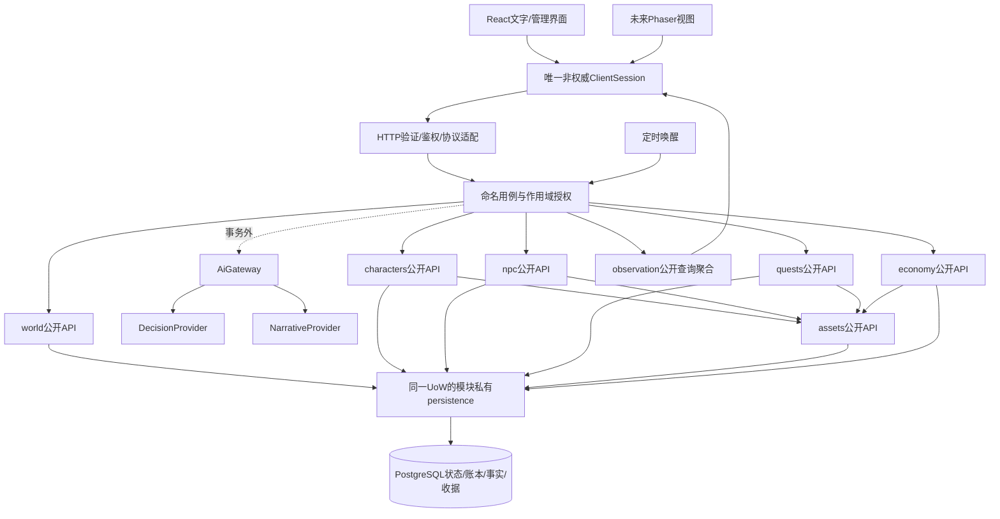

# AI MUD 目标架构

版本3.0 / 2026-09-18；PROPOSED、未实施；源码基线 `690cbc816051b30e323bb005c93c1396e1303c3c`，产品0.10.6。

本次在2.0的权威/事务/时钟收敛上加入模块合同与项目级护栏。一起读取：
- [项目约束](project-constitution.md)：PC-01—16。
- [模块化合同](modularity.md)：责任、公开API、事务参与、数据归属、扩展退役。
- [目标模块目录](module-catalog.json)：逻辑允许依赖图；尚无运行中的检查器。
- [架构基线](../implementation/2026-09-18/architecture-baseline.md) 与 [模块化补充包](../implementation/2026-09-18/modularity-baseline.md)。

原 `docs/architecture.md` 是执行模型提交的现状图，错误以审查报告校正；不能把本文当已实现。文档合并不授权自动开发。

## 1. 产品与容量范围

浏览器在线、共享小镇、个人探险、格子移动、自动战斗、持续NPC生活、低频语义判断。当前4个NPC和受邀内测只是近期验收规模，不是底层硬编码上限，也不是未测试的大并发承诺。

像素版默认只改变观察和输入表现。实时物理战斗、完整共享野外、离线本地权威、跨服交易、第三方可执行模组均是独立产品/架构决策。

## 2. 目标图

示意图省略identity/social和纯规则细节；完整模块允许边以catalog为准。App不是CommandBus，Tx不是全局数据库逃生口；公开参与API绑定同一事务，各自只能写自己拥有的事实。

## ADR-01 模块化单体与技术栈

保留TS/pnpm monorepo、Fastify、Postgres/Drizzle、React/Vite。内部模块API默认进程内，不为封装制造网络请求或拆服务。Node运行版本锁定并独立验证，数据库/依赖更新不与大重构混做。

唯一composition装配Db/UoW、Clock、AiGateway和模块；transport不通过app.di.db绕过用例。按真实热点提取GameService的资产/结算/读取，允许过渡门面，不因文件长而拆散原子业务。

## ADR-02 事实与可见范围

npc/world目标/market/treasury共享；角色/个人map instance独立；关系/私聊属于NPC×角色。所有API携带或可靠解析scope；不同实例同名地点不是同一份资源池。仅明确提交共享事件才能改变共享道路，个人副本胜利不自动改变全服。

每份可变事实有一个写所有者；共表阶段按列登记。余额/库存/托管金额归assets；任务条款与终态归quests；npc需求/关系/可信经历归npc；区域拓扑/资源池/世界进度归world。详细例外见modularity.md，不为了归属整齐一开始拆全库。

## ADR-03 一次业务用例，一次事实提交

服务器构建可信principal、授权、scope、commandId和epoch。UoW在一个真实事务内取得命令收据和一致锁计划，重读相关事实及到期状态，调用模块公开能力，提交资产/业务终态/必要可信事实/收据。

相同主体/kind/commandId/epoch与相同payload重试返回原结果；同key不同payload冲突。失败不得留下部分资产/义务；写收据失败也要回滚。锁序覆盖整个链路，不能helper内部排序却调用者先后反向锁根。

应用层拥有事务生命周期而不执行SQL；UoW提供tx绑定public API，模块persistence才拿到裸tx。不在持锁期间等待模型、用户或其他网络。测试fake不得默默把缺失事务当成功；关键证据用真PG故障注入。

实际余额、任务完成、托管释放、可信履约必须原子成立。表现文本/传闻/记忆压缩可延后或重建。不能用异步事件把付款与任务终态拆开，也不引入分布式Saga。

可支配量=实有-承诺预留-当前保护量。明确系统来源/消耗，不凭空生成奖励。装备最终只用item_instances；迁移保留ID/属性/耐久/owner，不触发新掉落广播。堆叠与实例保留不同存储，不做永久双真源。

## ADR-04 确定性时间与生命周期

Clock输出UTC；世界日程明确Asia/Shanghai，不取宿主默认时区。纯规则接收now/seed，不访问系统时钟或Math.random。保留60秒NPC步长和有限逐tick补算，不偷改经济节奏。

启动明确迁移/seed/runtime行。每tick短事务先锁world runtime根，再读最新进度，按统一顺序锁参与根，npc结算与进度一起提交；拿不到锁可跳过本轮。移除旧lease不校验owner的权威路径；不能只在最终saveProgress加锁。

timer只唤醒；管理员/请求/定时统一应用用例。单进程in-flight是防抖而非跨进程正确性证明。真实大负载或多副本发布需另测，不由一个行锁自动保证。

角色保持懒结算：sync用例可先推进本人再读取；CharacterSettlement只有一份算法。纯Query不seed/结算/模型调用；不能删除懒结算导致离线收益消失，也不为每个角色造1Hz计时器。

追赶有步数/墙钟预算和积压观测；相同时间/seed比较连续、不同批次与断点重启结果。模型不为历史每个tick补请求，只在有效当前目标窗口决策。

退出：停止新写入→停止唤醒→有界排空事务→取消网络→关闭连接。重置仅维护操作：排空在途后事务清理并递增epoch；旧客户端/模型响应不得写入新世代。

## ADR-05 事实、显示与传输分离

combat.hit等记录结构化参与者/伤害/剩余HP/时间。中文formatter/像素动画只消费事实；取消从战斗文字和教程正则反推状态。旧纯文本记录可展示，不升格成新的可信履约证据。

现有game_events/npc_events/sync_events/账本各自定责；不复制一套万能事件平台。事件带ID、kind、schemaVersion、scope/受众、必要causation。账本不是任务状态机，sync不是世界重建日志。bigserial不是提交顺序；不能只取最大ID就声称未漏事件。

cursor传输进度、revision领域版本、epoch世界世代分开。角色revision受角色根锁保护；市场/NPC用自己的版本，不伪造一个全局stateVersion。只读快照隔离语义明确，初期可完整快照纠偏；必要任务回报从持久义务读取，不能因漏通知永远消失。

同一ClientSession整合命令/poll，按epoch和对应revision处理旧覆盖；不按请求发送顺序推断提交顺序。公开Query批量读取防N+1；测量需要的跨域JOIN仅经登记只读view/投影，不能回写。

## ADR-06 AI为非权威、可替换能力

NPC持久状态不依赖某个模型实例。DecisionProvider从有限候选选ID；NarrativeProvider只组织已确认事实。API不要求决策模型生成自由文本理由；内部审计理由用规则reasonCode，叙事可后补。

application负责：读上下文→事务外调用AiGateway→重读事实/校验候选与版本→同事务执行→根据真实结果表达。只有一个合法候选直接规则执行。模型不生成任意数量/坐标/奖励，不直接调用repo；前端和模型自报权限无效。

AiGateway应用级实例统一用途开关、预算准入、并发/超时/取消和审计；可注入各域所需最小能力，不开放万能工具。AI审计存储可写调用元数据，但provider不能通过它获取世界DB。prompt只取获授权和必要字段，玩家陈述与system_verified分开。

预算、故障、迟到响应明确降级。核心sync不等待可选离线简报模型。世界NPC目标按NPC只选一次，不按玩家数量重复。真实Jev接口、中文效果/费用/延迟在v0.14独立核实，此架构不依赖旧宣传数值。

## ADR-07 公开模块API与纯规则依赖

模块public与bootstrap分开；private实现/ORM记录不泄漏。角色/NPC可以消费world/assets公开能力，quest/economy依赖assets；未列出的peer业务依赖由命名application用例协调。provider在ai能力域而不进入npc依赖图。

kernel只共用小型领域值；protocol存外部DTO；content依赖kernel；rules依赖kernel/content，不反向依赖UI/HTTP/DB。保留workspace，必要时先在shared内部细分，不强制建立大量npm包。

公开入口、精确依赖图和SQL归属通过门禁约束，迁移期legacy精确登记且不可增长。不能以public.ts包装所有internal或反射式DI绕开图。详细合同/配置/负例见modularity和MOD包。

## ADR-08 Renderer与部署不扩大玩法范围

浏览器像素默认Phaser+React；共享ClientSession、协议和服务端通行事实。Godot在原生/编辑器需求成为主导时重新评估。现在不装引擎，不把2D当成高频战斗同步需求。

单部署建议静态Web/API同源HTTPS、一个应用、内网Postgres；Cookie/CSRF统一测试，CORS不是授权。readiness/liveness分开；world积压/模型费用/SQL锁等待要可观测。锁定工具链和生产启动方式，有迁移备份恢复。

CI有真实测试数量、边界负例、PG与必要E2E。lint若只是tsc不得算另一类独立证据；passWithNoTests不能让错误过滤变绿。分支保护是否已启用要实际核实，不由文档推定。

## ADR-09 新功能、退役与例外

按change-spec模板定义归属/API/失败/数据生命周期，普通内容优先数据扩展。新模块有独立责任和实际消费者才新增；不追求每个功能一个模块。

停用先拒绝新操作，再处理在途/预留/托管与存档，再去除依赖。关键义务不靠可丢事件完成。所有依赖豁免精确、带删除任务，不许以修改allowlist为常规开发手段。PC-01—16是后续评审合同，修改须列ADR与独立审查。

同进程边界不是恶意代码沙箱，也不保证未来拆服务零重构。性能/发布/故障隔离有实证需求再拆；新玩法需要新原语时合法扩展合同，不绕路。

## 3. 本轮结束条件

1. tick竞争/重试/重启不重复结算、进度不倒退；统一生命周期可恢复。
2. 资产/任务/可信事实/命令收据同事务，装备单一真源；真PG验证。
3. 中文措辞/轮询频率不改变同时间seed应有结果；pure read不写世界。
4. 模型关闭/超时/旧epoch不破坏玩法或越权；真实模型有效性单列。
5. 公开接口/允许边/数据归属已迁移且负例能被门禁拒绝；债务项透明，不伪报零债务。
6. 不新增NPC/玩法/引擎即可验证，达到后回到最小玩法，不无限开发框架。
