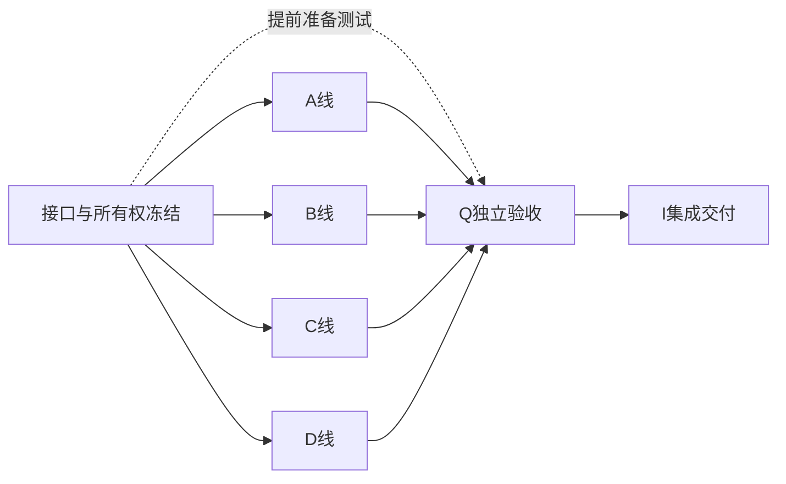

# 子代理并发开发合同

目的：同一冻结合同下多线交付，不是多代理各猜一套语义。本文与每版P/A/B/C/D/Q/I工作包共同生效。

## 1. 固定角色

主代理/集成者负责选择本轮范围、读取actual HEAD、发接口包、锁共享文件、接收变更提案、集成验收；不包办所有领域实现。A—D只写明确授予的文件。Q独立测试，不因测试失败擅自修改业务规则。若同一人兼任角色，也要分开证据与审查记录。

默认3—4个实现代理＋一个独立测试者。工作量过大可在同一角色内先后拆小任务；不能未经授权让两个代理并写同一文件。不同角色可读全部必要public/source，不代表有写权限。

## 2. P包必须先发什么

每版 `Mxx-P`（内测为M10-P）在前版实际提交上冻结：

1. `contractVersion`、当前API/schema/content基线与本轮允许增量。
2. 公开输入/输出、错误、principal/base scope、事务参与方法、字段唯一写者。
3. 有效/无效/旧版本样例、测试替身和共同fixture，不能用各自拼出的mock。
4. 精确文件所有权清单：每个可写文件只映射一个active owner；拟新增文件也先登记。
5. 依赖边、所需真实能力和谁来装配；尚未提供的能力明确mock-only、不得当最终交付。
6. 单线测试命令、集成场景、非目标、配置/迁移/恢复与付费调用限制。

模板见 [lane-contract](templates/lane-contract.md)。接口包可以很小；它不是在并发前把所有后端先实现，也不是冻结永远不可改的协议。

## 3. 精确文件所有权

版本文档里的NEW路径是建议落点，不证明当前已存在。A0/P必须按实际结构落实为文件清单；没有登记的生产文件不得悄悄创建。清单是本轮授权，不给某代理整个server或shared的无限写权。

以下共享文件默认由P/I唯一负责人写，业务线提交提案：
- `packages/shared/src/`本轮公共DTO/值类型文件和`version.ts`。
- `apps/server/src/db/schema.ts`、新增迁移、journal；不得改已执行迁移，也不预定下一SQL编号。
- `apps/server/src/app.ts`及真实composition、公共路由/配置注册。
- 新客户端session、入口切换、共享API client与design tokens（指定负责人可正式移交单线，但不可同时写）。
- 根及子包package.json、pnpm-lock.yaml、tsconfig、构建/测试发现配置、CI。
- module-catalog、module-boundaries、legacy debt与架构检查器。新增模块按PC策略独立审查；普通实现不能改allowlist变绿。
- 共用测试fixture/数据库setup：P创建冻结版，Q提补充，其他代理只消费。

某线自己的实现文件与同名unit test归该线；Q的新集成测试可放批准的隔离目录，P负责接入实际runner。不是所有`.test`都可穿透peer内部；数据库fixture只用登记的setup能力。

## 4. 工作区、数据库与提交

每条线从同一合同提交创建独立worktree/分支和独立测试数据库/schema，端口也隔离。子代理不得在共享main工作树checkout/reset/merge；不得共享可能被drop的DATABASE_URL。根命令会读取.env，运行任何迁移/reset验证前必须确认指向临时测试实例。

一项聚焦任务一个提交，先失败用例再实现。提交说明带工作包ID。不自动安装额外模型/引擎，不把路径搬迁、规则调参、依赖升级和隔离级别变更揉在同一提交。

A—D完成可分别提交实现PR，或由主代理汇入同一集成分支；主代理决定合并顺序和冲突处理。执行子代理不能自行批准、合并或发布。新版本不是并行分支上各自写一遍PRODUCT_VERSION。

## 5. 合同变更握手

发现接口不足时：提供最小失败场景→向P提变更→P更新合同、样例、版本与消费者列表→通知受影响线重基线→再继续。不能临时给DTO加可选any字段、跨库JOIN、回调或service locator绕过。

明确被依赖能力尚未就绪时，可在隔离测试替身下继续本线；交接必须标PARTIAL_MOCK。共享合同不稳定时不得偷偷做真实连接。模型、暂停时间和内容版本都不可由客户端自作主张补默认值。

## 6. 集成顺序与并发DAG

实际流程：P完成→多线实现/测试准备→主代理装配候选HEAD→Q在候选HEAD验证→问题回到明确责任线修复→重跑相关门槛→I签收同一HEAD。I仍负责记录版本/迁移/回退，不以“装配是最后才做”为理由延迟真实接口验证。

每次尽早跑一条纵向链，如注册→基地→施工→资源变化→快照；后续再覆盖制造和协作。不要让所有线结束才发现字段、事务和时钟理解不同。

## 7. 允许提前开展，禁止提前验收

| 提前线 | 条件 | 禁止 |
|---|---|---|
| M14-A Jev适配/离线测例 | M12-P冻结DecisionPort示例，可mock | 不安装到生产/不自动付费/不宣称真实游戏效果 |
| M13-B 后台原型 | 内容schema与样例已冻结 | 不直接编辑实时存档 |
| M15-A 天气纯规则 | 环境/时间输入合同冻结 | 不与能源线重复扣电/造随机世界时钟 |
| M16-D 订单UI | M13内容与制造合同可用 | 不自行实现钱包或共享实时市场 |

里程碑发布仍线性。提前工作的实际依赖需要到目标版P再次核实，不因开发起得早就允许使用旧合同。业务关键路径不得跨版争写同一文件。

## 8. 交接与验收

每线交接：contractVersion、起止HEAD、实际改动文件、调用/暴露的public API、测试命令/数量/环境、NOT_RUN、尚在mock的连接、迁移/恢复、删去的旁路。参考 [evidence](templates/evidence.md)。

ENGINEERING、真人试玩、真实模型和运行恢复分别标记。测试发现为0、lint只是tsc、静态推演或历史CI不能代替本版证据。绝不通过删除失败用例、全目录豁免、伪造测试结果达成完成。

本文件不承诺所有工作完全并行。必须串行的合同、schema和集成保持小而明确；可以并行的领域、内容、界面和测试尽量不互相等实现。
