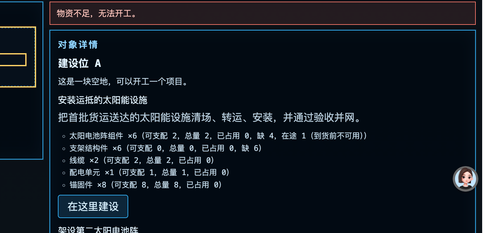
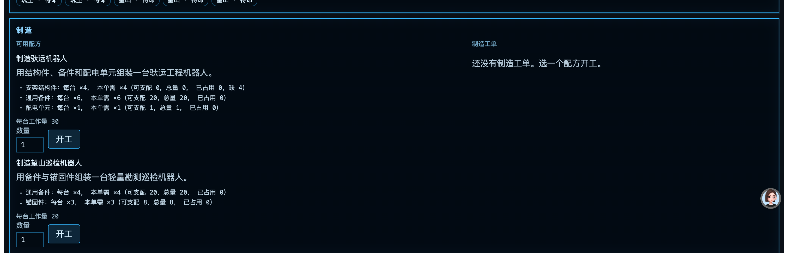

# 《余电》首轮真人试玩反馈：经营游戏定位与新手体验复盘

2026-09-26。核对版本：线上 main 合并提交 ac61a17f4fbc7801f4c401944735e445bfbf824e；本报告所在分支只记录问题，不修改游戏、数据库或部署。

## 结论与证据边界

**当前版本不具备模拟经营游戏的产品验收条件。** 工程链可以运行，真实数据库能保存进度，但玩家获得的是一个预先建成大半、主要靠外部采购和系统订单推进的基地。新手没有亲手建立基础生产能力，后续也缺少“采集 → 加工 → 制造 → 建设 → 扩张”的本地循环。长页面和原始台账字段进一步掩盖了目标、选择与结果。

这是用户第一次真人试玩后的反馈，不是本报告作者重新完成的一轮盲玩。下列三张截图是玩家可见状态；源码用于解释这些状态的可能原因，不能替代未录下的操作过程。截图未显示的时长、反复操作和玩家后续路径不据此推断。2026-09-25 的 AI 试玩评审曾明确判定已测范围“不好玩”，并记录过订单套利和失败反馈问题；随后修复了部分技术故障与文字提示，却没有重新验证本作是否达到了用户期待的经营玩法。我在 PR #36 发布后将工程通过与本机闭环称为可供验收的 MVP，是评审标准选错，现撤回这一产品判断。

## 六项问题记录

| 编号 | 玩家反馈与裁决 | 已核对的事实 | 根因与复验目标 |
| --- | --- | --- | --- |
| H01 · 整页下拉 | **P1，确认。** 经营和主场景依靠纵向页面、折叠区及长卡片；核心操作需要寻找位置。 | [BaseShell.tsx](../../../../apps/web/src/features/base/BaseShell.tsx) 把目标、导航、状态、地图、详情、项目清单依次堆在主页面；[base.css](../../../../apps/web/src/features/base/base.css) 给外壳最小高度而非固定工作区高度，顶栏还用多个 details。图 1、3 显示正文长列表。 | 界面直接陈列数据结构，没有“一个决策现场”。桌面基准视口应让目标、地图或场景、当前对象操作和即时结果同时可见；历史与完整库存可在局部面板滚动，不让玩家为一次决策滚整页。小屏使用分屏/切换，不强行塞满一屏。 |
| H02 · 开局已建成 | **P0，确认。** “随船带来基础设施与设备”不等于“设施落地即安装完成”；我此前把这两件事说成冲突，是错误解读。 | [默认开局内容](../../../../packages/content/src/base/default-release.ts) 把太阳能阵列、储能间、仓储棚、维护工位、充电区五处直接标为 built，预置 15 kW 发电、12 台已实例化设备及首项目材料；[教程内容](../../../../packages/content/src/base/tutorial-release.ts) 继承这些状态，仅调整驮运电量和配方修订。首个可建项目是在已有 15 kW 上再加 5 kW。 | 把“货物、设施组件和机器人已运抵”误做成“功能已交付”。新档地图应从着陆器和待部署货箱开始，固定设施尚未运行；玩家亲手完成开箱、选址、安装、接电、投产，每一步有可见状态变化。保留能自举的最低操作条件，避免零电零设备死局。 |
| H03 · 缺料后没有路 | **P1，确认当前呈现；是否彻底无法继续，单张截图不能证明。** 图 1 的项目缺 4 组件和 6 支架，按钮仍可点，拒绝后只见“物资不足，无法开工”。 | [ObjectPanel.tsx](../../../../apps/web/src/features/base/ObjectPanel.tsx) 在显示缺口时仍渲染可点击开工按钮；[construction.service.ts](../../../../apps/server/src/modules/industry/construction.service.ts) 只返回通用错误；[BaseApp.tsx](../../../../apps/web/src/features/base/BaseApp.tsx) 将错误作为字符串展示。经营页另有采购预算，但需玩家自己切换寻找。 | 失败反馈没有把缺口变成下一步行动。操作现场应显示“还缺什么 → 可由哪里取得 → 现在可做哪件事 → 完成后回到此处”；若必须采购或生产，给就地入口和返回原项目的上下文。不能只把错误提示挪近。 |
| H04 · 制造不像生产 | **P1 界面，关联 H06 的 P0 内容缺口。** 图 3 左侧是两段物料说明和输入框，右侧大面积空白的“制造工单”；玩家看不到生产线或产出计划。 | [ManufacturingBoard.tsx](../../../../apps/web/src/features/base/ManufacturingBoard.tsx) 固定两栏 3:2，右栏没有工单时只留一句空态；现有配方仅为两种机器人。文本逐项暴露“每台、本单、可支配、总量、占用”等台账字段。 | 制造页按表单和列表设计，而非按玩家的投入、产出、耗时与用途设计。先补可运转的原料链，再让玩家在同一工作区选择配方、看所缺来源、安排机器、看到产出流向；无工单时不保留空白半屏。 |
| H05 · 经营与 credits 缺乏意义 | **P0，确认核心设计缺口。** credits 并非完全无用途：它能购买外部材料；但订单主要把初始或购入物资卖回系统，缺少玩家创造价值的过程。 | [EconomyBoard.tsx](../../../../apps/web/src/features/base/EconomyBoard.tsx) 的经营区只有订单、预算、采购；[价目](../../../../packages/shared/src/economy.ts) 为固定外购价；[订单模板](../../../../packages/content/src/base/default-release.ts) 以同样物资支付固定奖励。[订单服务](../../../../apps/server/src/modules/economy/order.service.ts) 在交付时入账，结案 24 基地小时后可再开单；当前服务未体现外部买方预算。 | “交物资 → 得货币 → 买物资”是外部兑换回路，不是基地经营。应先建立基地内的生产与消耗，再决定是否需要外部账款；若保留，明确它购买哪些本地产不出的稀缺物、为什么有订单需求及预算限制。新手前 30 分钟不应靠刷账款推进。 |
| H06 · 没有采集、消耗、制造、扩张链 | **P0，确认当前内容范围。** 电力和设备确有运行消耗，但物料没有玩家可操作的本地来源。 | [基地内容](../../../../packages/content/src/base/default-release.ts) 只有两项太阳能建设、两项机器人制造、三类外部收购订单；六种材料来自开局库存或固定价采购。当前基地内容目录没有采矿、精炼或材料制造模板。 | 主打“基地经营”缺少资源转换与约束选择。最小可玩切片应让机器人勘探/采集至少一种本地资源，加工消耗电与时间，制造可用于下一设施的部件；建设扩大采集、供能或制造能力，维护又持续消耗资源。玩家应能选择把机器人和电力投入哪条链，并看到机会成本。 |

### “可支配”究竟是什么意思

代码里的数量是“仓库总量减已被工程或制造工单预留的数量”，在途货物还没有入库，不能计入可用量。这是正确的账本区别，却不是新手首先需要学习的词。图 2 把所有物品都标“可支配”，使人误以为存在“归我所有却没有支配权”的制度。建议在普通物品栏只写“仓库可用 2”；玩家准备开工时再显示“本项目需 6，仓库可用 2，另有 1 在途，仍缺 3”，有预留时解释被哪个项目占用。技术台账保留在详情里。

### credits 的具体缺陷

按当前固定价直接从补给站购买并交付同物资订单，太阳电池组件 4 件成本 480、奖励 700，账面多 220；支架 6 件成本 240、奖励 500，多 260；备件 10 件成本 300、奖励 450，多 150。采购需等待 20 基地分钟，订单重新开放有 24 基地小时冷却，因此不能说“无限即时刷钱”；但这三种正差价都无需本地生产，经营动机已被扭曲。这一计算来自当前内容与规则，长程重复收益仍需实机验证。早前评审已指出同一方向的问题，本轮没有从根本上解决。

## 根因：不是六个孤立的 UI bug

1. **开局状态替玩家完成了建设。** 初始内容把五处设施设为已建成，教程只能引导“在现有基地上加一座阵列”。开场弹窗只出现一次，关闭后按基地记住；所谓六段主要由项目、订单、在途等既有事实推导，第二阵列只要有一点真实工作量就显示“本轮教程已完成”。它跟“玩家亲手把空基地建起来”不是同一目标。
2. **资源图只有外部输入，没有本地产出。** 项目消耗组件，机器人配方也消耗组件；补充组件靠外购。电力生产与消耗已存在，但没有让电力、机器人、矿物和制造组成可以反复决策的经营回路。缩短到货时间只是缩短等待，不会补上生产。
3. **界面围着数据库字段排版。** 页面以总览、物资台账、设施详情、订单列表、配方表单顺序展开；玩家需要的是“我想做什么、需要什么、改完会怎样”。仅改字体、边框或把提示悬浮，仍解决不了布局和因果问题。
4. **验收尺子偏向实现合同。** 真实 PG、CI、同档首工程完工与第二阵列开工证实系统可运行，却没有检验“空场落地到自给建设”的玩家承诺。先前 AI 评审说过“不好玩”、订单套利等问题，后来仍以修完工程阻断和六段提示作为发布判断。这是评审失误，不能归因于玩家没看懂。

## 改版方向：先设计一段真正可玩的纵向切片

这里是供讨论的候选，不是已批准的新规格或实施授权。

- **开局**：着陆器、封存货箱、必要的临时电源和少量可启动施工能力；可带约 12 台机器人，但未必全部已启用。地图上的常设供电、储能、仓储、维护、充电设施都要由玩家部署或安装。明确自举路径，不让第一步因没电、没仓库而死锁。
- **首个循环**：拆封物资并选址 → 安装电力/仓储 → 派机器人勘探与采集 → 消耗电力加工原料 → 制造建材或设备 → 建起能扩大产能的新设施。每个节点都有可见投入、产出、时间和代价。铁、铜等资源是否入第一切片，以用途区别为准，不为凑资源种类而添加。
- **经营选择**：同一批机器人在采集、施工、维护间分配；电力在充电、加工、建设间竞争；材料留给扩张还是交付有限订单。至少有两条理由可说明的做法，而不只是“等 20 分钟”“点同一个采购按钮”。
- **桌面工作区**：目标与电力/时间在紧凑顶栏；地图常驻主区域；选中设施后的成本、操作、结果在旁侧固定区域；下方只显示当前生产和施工队列。1280×800 基准视口完成一次核心决策不滚整页；长库存和历史在局部面板滚动。窄屏按同一信息优先级切换视图。
- **货币**：先验证本地物料循环。credits 可暂时退居外部补给额度；只有当稀缺进口、有限订单和再投资真实影响建设路线时，才让它进入新手主流程，并使用能说明用途的中文名称。

## 重新定义验收

本版维持 **工程已部署、产品未通过**。下一次不能以构建、迁移、按钮可点或教程段数作为模拟经营验收。至少要在新档、无攻略、真人可见界面中验证：

1. 玩家不看源码或口头讲解，能说出落地后第一项设施为什么要自己安装，并完成安装；已建成的地图对象不会提前占掉这段玩法。
2. 一次 30–45 分钟会话里至少完成一次真实的“采集 → 加工/制造 → 建设或升级”链，投入、产出与下一步都能从现场看出来；不是外购材料代替所有生产。
3. 在至少一个资源或电力约束处，玩家能作两种有不同后果的安排，并在同一存档看到差异；一次缺料失败能就地指出可行恢复路径。
4. 桌面基准视口的核心操作无需滚动整张页面；界面把物料来源、库存、预留、在途讲清楚，但默认不把完整账本术语淹到首屏。
5. 订单和货币有明确来源、用途与预算约束；同物资外购再交付不会凭空形成稳定利润。旧基地和历史内容继续按其原版本保存，新教程只影响明确选择的新档；迁移方案另审。

仍需先决定：开局可直接启用几台机器人、着陆器提供多少临时电力、首个本地资源及其真实用途、credits 是否在第一轮出现。这些是数值/内容选择，不影响上述“运抵不等于已安装”和“必须有本地生产循环”的方向。本报告未注册新账号、未修改线上数据，也未对用户存档继续操作。
