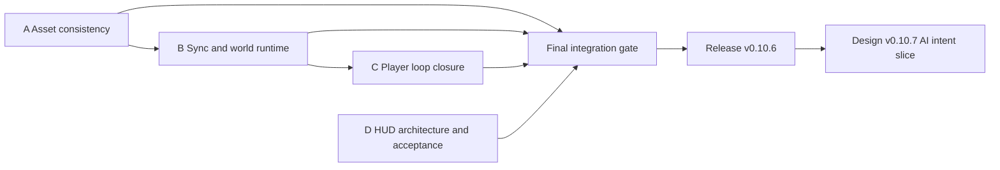

# v0.10.6 根因修复总控执行计划

> **For agentic workers:** REQUIRED SUB-SKILL: Use superpowers:subagent-driven-development (recommended) or superpowers:executing-plans to implement this plan task-by-task. Steps use checkbox (`- [ ]`) syntax for tracking.

**目标：** 关闭阻止当前 v0.10.5 成为可靠 v0.10.6 内测候选的资产、同步、恢复和 HUD 阻断问题。

**架构：** 按明确依赖门禁执行四个有边界的工作包。资产一致性先落地；同步与世界生产沿用其迁移序列；玩家恢复建立在修正后的同步读模型上；HUD 可并行开发，但只能在真实玩家流程稳定后收口。

**技术栈：** TypeScript、pnpm monorepo、Fastify、PostgreSQL/Drizzle、React/Vite、Vitest、Playwright。

---

## 1. 输入文档

- Design: `docs/superpowers/specs/2026-07-12-v0.10.6-root-cause-remediation-design.md`
- Acceptance report: `docs/reviews/2026-07-12-v0.10.5-product-code-acceptance-report.md`
- Package A: `docs/superpowers/plans/2026-07-12-v0.10.6a-asset-consistency-execution-pack.md`
- Package B: `docs/superpowers/plans/2026-07-12-v0.10.6b-sync-world-runtime-execution-pack.md`
- Package C: `docs/superpowers/plans/2026-07-12-v0.10.6c-player-loop-closure-execution-pack.md`
- Package D: `docs/superpowers/plans/2026-07-12-v0.10.6d-hud-acceptance-execution-pack.md`

## 2. 分支与提交规则

- Work from a fresh worktree based on the current accepted base; do not reuse the stale `codex/v0.7.1-critical-debt` branch name for release work.
- Recommended branch: `codex/v0.10.6-root-cause-remediation`.
- Preserve the existing uncommitted HUD prototype as an explicit patch or commit before creating the worktree; never discard it.
- Each task produces one focused commit.
- Commit titles follow the repository's English imperative style.
- Every commit includes:

```text
Constraint: <the external rule preserved by this change>
Rejected: <alternative> | <why rejected>
Confidence: high|medium|low
```

## 3. 依赖关系



Package D may start after the approved UI prototype is preserved, but it must consume the final DTOs from B/C before closing.

## 4. 版本纪律

- Keep `PRODUCT_VERSION="0.10.5"` during package work.
- Package A owns migration `0022` and bumps `schemaVersion` plus `economyVersion` on its branch.
- Package B takes the next available migration after A and bumps `schemaVersion` and `apiVersion` as required.
- Package C takes the next available migration after B and bumps `schemaVersion`, `apiVersion`, and `rulesetVersion` only where behavior contracts changed.
- Package D bumps `apiVersion` only if shared DTOs change; CSS/component-only work does not bump compatibility numbers.
- The final integration commit sets `PRODUCT_VERSION="0.10.6"` and adds `docs/releases/v0.10.6.md`.
- Do not create `v0.10.6a` or similar product versions; A-D are internal work-package labels.

## 5. 执行顺序

### 任务 1：保存并基线化当前工作树

**Files:**
- Inspect: `apps/web/src/features/game/GameShell.tsx`
- Inspect: `apps/web/src/features/game/GameShell.css`
- Inspect: `apps/web/src/features/game/GameShell.test.tsx`
- Inspect: `docs/superpowers/prototypes/`

- [x] **Step 1: Record the current status and diff**

Run:

```bash
git status --short --branch
git diff --stat
git diff --check
```

Expected: only the known HUD work and prototype files are present; `git diff --check` prints no errors.

- [x] **Step 2: Preserve the approved HUD direction**

Create a focused commit containing only the current approved prototype/HUD direction, or export it as a named patch before creating a worktree. Do not mix remediation code into this preservation commit.

- [x] **Step 3: Create the remediation worktree**

Use `superpowers:using-git-worktrees` and create `codex/v0.10.6-root-cause-remediation`.

### 任务 2：执行 Package A

**Plan:** `docs/superpowers/plans/2026-07-12-v0.10.6a-asset-consistency-execution-pack.md`

- [x] Execute every checkbox in Package A.
- [x] Run the package gate.
- [x] Review all SQL for nonnegative constraints, lock ordering, and rollback behavior.
- [x] Record Package A's final migration number and compatibility versions in this plan's progress notes.

Gate:

```bash
CI=true pnpm --filter @ai-mud/server test -- game.service game.repository item.service
pnpm test:postgres
git diff --check
```

Expected: concurrent gathering and market integration tests pass; no negative balances or duplicated cycle rewards.

**Package A completion record (2026-07-13):**

- Migration: `0022_asset_nonnegative_guards` (`journal idx=21`); the intentional filename gap `0021` remains unused.
- Compatibility: `schemaVersion=22`, `economyVersion=4`, product version remains `0.10.5`.
- Commits: `9a9d569`, `4af6981`, `5a4a4d2`, `0f5d46c`, `3a5c475`.
- Evidence: `pnpm db:verify-migrations` passed on a temporary PostgreSQL database; `pnpm test:postgres` passed 2 files / 6 tests, including two-connection gathering, market stock/balance, repair, and active-action concurrency cases.

### 任务 3：执行 Package B

**Plan:** `docs/superpowers/plans/2026-07-12-v0.10.6b-sync-world-runtime-execution-pack.md`

- [x] Rebase Package B on accepted Package A.
- [x] Assign the next migration number after A.
- [x] Execute every checkbox in Package B.
- [x] Confirm no game route calls `syncOpenTasks` or `syncRumors`.
- [x] Confirm AI calls occur outside database transactions.

Gate:

```bash
rg -n "syncOpenTasks|syncRumors" apps/server/src/modules/game apps/server/src/modules/world-runtime apps/server/src/app.ts
CI=true pnpm --filter @ai-mud/server test -- game.routes npc-task rumor world-runtime
CI=true pnpm --filter @ai-mud/web test -- useGameSync
pnpm test:postgres
```

Expected: search results show production calls only from scheduler-owned background orchestration; sync tests include tasks/rumors and stable polling.

**Package B completion record (2026-07-13):**

- Migration: `0023_world_rumor_source_unique` (`journal idx=22`); `schemaVersion=23`, `apiVersion=36` because task location was added to the game DTO.
- Scheduler boundary: `WorldPostTickService` processes bounded task candidates and rumors after real world-tick progress; it never runs in the world transaction or game route enrichment path.
- Commits: `0f39a3b`, `7635f32`, `6d00198`, `d29ca3b`, `24c298c`, `aeda269`.
- Evidence: route production search contains `syncRumors` only in the scheduler-owned post-tick service; 113 server tests, 11 polling tests, migration verification, and 6 PostgreSQL integration/concurrency tests passed.

### 任务 4：执行 Package C

**Plan:** `docs/superpowers/plans/2026-07-12-v0.10.6c-player-loop-closure-execution-pack.md`

- [ ] Rebase Package C on accepted Package B.
- [ ] Assign the next migration number after B.
- [ ] Execute every checkbox in Package C.
- [ ] Verify both a fresh player and a hunger-zero returning player can reach a productive action without database edits.

Gate:

```bash
CI=true pnpm --filter @ai-mud/server test -- game dialogue npc-task offline-report
CI=true pnpm --filter @ai-mud/web test -- GameShell
pnpm test:postgres
```

Expected: relief is bounded and audited, task actions work inside dialogue, invalid actions are absent, failed market operations keep context.

### 任务 5：执行 Package D

**Plan:** `docs/superpowers/plans/2026-07-12-v0.10.6d-hud-acceptance-execution-pack.md`

- [ ] Reconcile Package D with final B/C DTOs.
- [ ] Execute every checkbox in Package D.
- [ ] Keep `GameShell.tsx` at or below 300 lines unless a written exception explains the remaining orchestration.
- [ ] Run browser screenshots and outer-scroll assertions at all required widths.

Gate:

```bash
CI=true pnpm --filter @ai-mud/web test
pnpm --filter @ai-mud/web e2e
```

Expected: all E2E tests pass; 1440x900, 1180x900, and 980x900 have no outer page scroll; modal/input contexts block movement.

### 任务 6：执行集成发布门禁

**Files:**
- Modify: `packages/shared/src/version.ts`
- Modify: `packages/shared/src/version.test.ts`
- Create: `docs/releases/v0.10.6.md`
- Modify: `docs/superpowers/plans/2026-07-02-v0.8-v1.0-closed-beta-roadmap.md`

- [ ] **Step 1: Run all non-browser gates**

```bash
CI=true pnpm -r test
CI=true pnpm -r typecheck
CI=true pnpm -r lint
CI=true pnpm -r build
pnpm db:verify-migrations
pnpm test:postgres
pnpm db:verify-world-reset
git diff --check
```

Expected: every command exits 0; no skipped PostgreSQL migration test in the explicit `pnpm test:postgres` run.

- [ ] **Step 2: Run the real player E2E**

```bash
pnpm --filter @ai-mud/web e2e
```

Expected: real-backend registration-to-chat flow passes; mock-only smoke tests also pass.

- [ ] **Step 3: Run operational acceptance**

Run the live-clone 7-day NPC simulation and capture the report. Assert:

```text
health.ok = true
idleRate < 0.30
starvingNpcCount = 0
marketTransactionsPerDay > 0
taskTriggerRate > 0
asset ledger drift = 0
```

- [ ] **Step 4: Bump the product version**

Change:

```ts
export const PRODUCT_VERSION = "0.10.6";
```

Use the compatibility versions established by A-C; do not guess or reset them.

- [ ] **Step 5: Write the Chinese release note**

`docs/releases/v0.10.6.md` must include scope, fixed root causes, migrations, known limitations, verification outputs, and the explicit statement that AI intent planning remains v0.10.7 scope.

- [ ] **Step 6: Commit the release closeout**

```bash
git add packages/shared/src/version.ts packages/shared/src/version.test.ts docs/releases/v0.10.6.md docs/superpowers/plans/2026-07-02-v0.8-v1.0-closed-beta-roadmap.md
git commit -m "Close the v0.10.6 remediation release"
```

## 6. 停止条件

Stop integration and return to the responsible package if any condition occurs:

- duplicate asset grant or negative balance under concurrency;
- AI/network call observed inside an open database transaction;
- game route generates public tasks or rumors;
- 980x900 requires outer scrolling for primary gameplay;
- fresh/returning player requires developer intervention;
- real E2E is replaced by mocks to make the gate green;
- a roadmap item is marked closed without a matching executable test.

## 7. v0.10.6 后续交接

After release acceptance, start a separate brainstorming/spec cycle for `v0.10.7 AI-native NPC intent loop`. Do not begin that implementation from this plan.
