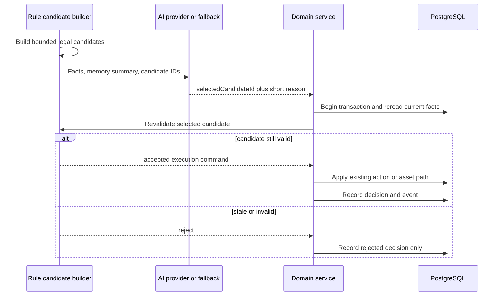

# v0.10.7 AI 原生 NPC 意图闭环执行包

**目标：** 让 AI 在不拥有资产和世界写权限的前提下，真实参与 NPC 的资源让渡取舍与日常目标选择，形成“观察事实 -> 检索记忆 -> AI 选择合法候选 -> 规则复核 -> 世界执行 -> 事件/记忆反馈”的可观察闭环。

**基线：** `v0.10.6`，`schemaVersion=25`、`apiVersion=39`、`rulesetVersion=16`、`contentVersion=12`、`promptVersion=8`。

**架构：** 不新增第二套行动引擎。规则层生成完整合法候选，AI 只返回候选 ID 和短理由；对话服务或 `WorldPostTickService` 在 AI 调用结束后重新读取最新状态，通过事务提交选择，现有 `NpcService`、`NpcTaskService` 和资产服务负责执行。

---

## 1. 当前问题与本版完成定义

### 1.1 当前问题

- `decideNpcResourceRequest` 用固定关系阈值直接决定赠予，并在解析时把玩家索要的数量截断，导致“索要 100 铜币”可能被解释为“索要 5 铜币”。
- NPC 的长期工作目标由 `createNextNpcAction` 固定选择，AI 不参与“今天做什么”。
- NPC 需求任务虽然真实且有托管资产，但 AI 只改标题、描述和理由，不决定 NPC 是否选择“向玩家求助”。
- `CLAUDE.md` 中“AI 只能生成文本”的表述过窄，和已经确认的产品目标冲突。

### 1.2 完成定义

本版必须同时关闭两个闭环：

1. **对话资源让渡闭环**：NPC 面对玩家索要时可以选择拒绝、满足原请求或给出规则生成的部分帮助；人格、可信记忆、关系、请求表达和牺牲成本会参与 AI 选择，但库存和保留量永远由规则决定。
2. **世界目标闭环**：空闲 NPC 在规则提供的工作、补给、出售、求助、维护、巡视、返乡、休息候选中选择阶段目标；目标驱动现有移动/采集/市场/任务行为，并在事件与对话中可见。

仅实现其中一个，不算 `v0.10.7` 完成。

## 2. 明确不做

- 不让 AI 输出任意 action、坐标、物品 ID、数量、价格或奖励。
- 不让 AI 直接调用 repository 或在数据库事务中等待网络。
- 不用 AI 接管饥饿归零、受伤、无路可走等硬安全规则。
- 不在每分钟 tick、每个移动格、每轮采集或睡眠期间调用 AI。
- 不实现天气系统；候选输入预留 `worldSignals` 标签即可。
- 不统一玩家/NPC 两套行动表，不重写战斗系统。
- 不新增泛化工作流引擎或可配置 DSL。

## 3. 核心数据流

### 3.1 通用选择协议



### 3.2 模型输出合同

所有意图选择 purpose 共享最小输出结构：

```ts
export interface CandidateSelectionOutput {
  selectedCandidateId: string;
  reason: string; // 中文，1-80 字，不作为执行参数
}
```

约束：

- parser 只接受 JSON object，拒绝额外字段；
- `selectedCandidateId` 必须严格命中本次调用提供的候选集合；
- `reason` 只用于审计和沉浸文本，永远不参与资产计算；
- 输出上限固定为 120 tokens；候选最多 6 个；
- 不依赖模型自报 `safety` 布尔值，安全性由封闭候选和二次校验保证。

### 3.3 AI purpose

新增：

```ts
type AiCallPurpose =
  | ExistingAiCallPurpose
  | "npc_resource_decision"
  | "npc_world_intent";
```

两者都使用：

```ts
authorityClass: "classification"
mutatesWorldState: false
allowedStateEffects: "none"
fallbackRequired: true
```

“AI 选择候选后规则执行”不等于 AI 获得 world mutation 权限。

## 4. 规则合同

### 4.1 资源请求

规则层先解析并保留玩家的原始请求，不再提前截断：

```ts
type NpcResourceRequest =
  | { kind: "item"; itemId: ItemId; requestedQuantity: number }
  | { kind: "copper"; requestedCopper: number };
```

规则根据最新已知事实生成候选：

- `refuse`：永远存在；
- `grant_exact`：仅当 NPC 实际持有且扣除后不低于生存/职业保留量；关系或记忆不能提前删除这个合法候选；
- `grant_partial:<amount>`：仅当原请求无法或不宜全部满足，数量由规则计算并固定；
- 不支持的物品、无法识别的请求或只有拒绝候选时，不调用模型。

AI 输入可以包含：

- NPC 人格、职业价值观和当前目标；
- 玩家原话，但必须标记为不可信输入；
- 熟悉度、信任、近期帮助次数；
- 最多 6 条压缩后的 `system_verified` 记忆摘要；
- 每个候选对 NPC 的牺牲等级，如 `trivial / meaningful / severe`；
- 不暴露内部数据库 ID、完整资产表或无关玩家数据。

规则不得把“高好感”转换为必然赠予，也不得仅因陌生关系就删除 NPC 实际承担得起的候选。是否选择由 AI 判断；模板 fallback 对陌生人和高牺牲请求保持保守。

事务提交前必须重新读取 NPC 库存/铜币、保留量和最近让渡记录。若状态变化，记录 `stale`，不得偷偷切换到另一个候选。

### 4.2 世界目标

规则层只在 NPC 无 active action 且没有仍有效的 current goal 时建立候选。硬优先级仍由规则直接处理：

1. 饥饿、受伤、资产非负与行动合法性；
2. 夜间返乡/休息窗口；
3. 已存在目标的逐格移动或挂机动作；
4. 只有需要新目标时才进入 AI 选择。

首版目标种类：

```ts
type NpcWorldGoalKind =
  | "work_resource"
  | "buy_supply"
  | "sell_surplus"
  | "request_supply"
  | "maintain_workplace"
  | "inspect_market"
  | "return_home"
  | "rest";
```

每个候选必须由规则完整给定目标、可执行前提和失效条件。AI 不选择坐标、路线、采集数量、交易价格、任务奖励或执行时长。

目标有效期为 2-6 小时或直到完成/失效。逐格移动继续由现有 `nextNpcTravelStep` 执行；一个目标期间移动十格只产生十个行动结算，不产生十次 AI 调用。

### 4.3 需求任务桥接

- 现有 `NpcTaskService.detectCandidates` 继续拥有需求、物品、数量、奖励和托管校验。
- 需求候选作为 `request_supply` 世界目标候选之一，不再在每次 post-tick 自动提交所有任务。
- AI 或 fallback 选择 `request_supply` 后，现有 `npc_task_proposal` 可以继续生成表现文本；最终仍由 `commitCandidate` 在事务中复核并托管奖励。
- 同一 NPC 继续受“只允许一个 open/accepted 任务”的部分唯一索引保护。

### 4.4 世界时间

- 新增 canonical 世界时区配置，首批内测固定为 `Asia/Shanghai`；不能继续让 UTC 08:00 被玩家误认为本地饭点。
- 饭点、休息窗口、每日计划 key、工资和每日维护统一使用同一个纯函数世界时钟。
- 数据库存储仍使用 UTC timestamp；只在规则计算和展示时转换。

## 5. 持久化与幂等

### 5.1 Migration `0026_npc_intent_decisions`

新增：

- `world_actors.current_goal` JSONB nullable；
- `world_actors.current_goal_expires_at` timestamptz nullable；
- `world_actors.current_goal_decision_id` UUID nullable；
- `npc_intent_decisions`：
  - `id`
  - `npc_actor_id`
  - `purpose`
  - `trigger_key`
  - `candidate_set_hash`
  - `selected_candidate_id`
  - `decision_source` (`ai | template`)
  - `decision_reason`
  - `validation_outcome` (`accepted | stale | invalid`)
  - `metadata`（只存必要引用和聚合，不存整段 prompt）
  - `created_at`

唯一约束：`(npc_actor_id, purpose, trigger_key)`。它负责阻止租约重试或重复 post-tick 对同一计划窗口重复选择。

`current_goal` 只是 `NpcService` 的持久输入，不建立第二套行动状态机；行动事实仍在 `npc_actions`。

### 5.2 触发 key

- 世界目标：`<npcId>:<worldDate>:<planningWindow>`；
- 对话请求：玩家 dialogue message ID；
- catch-up tick 只在 scheduler 完成后以真实 `now` 运行一次 post-tick，不为历史每分钟补打 AI 调用。

### 5.3 世界重置

- `npc_intent_decisions` 是世界数据，重置时清空；
- `world_actors` 本来会重新 seed，current goal 不保留；
- `ai_call_logs` 继续作为审计数据保留并解除旧 actor 关联，沿用现有 reset 规则。

## 6. 调用与成本预算

- `npc_world_intent`：每个 NPC 最多 4 次/自然日，事件重规划最多再 2 次；
- `npc_resource_decision`：按玩家消息触发，沿用对话限流，并增加 NPC/玩家组合短冷却；
- active movement、gathering、market action、maintenance、rest 期间不调用；
- 只有一个合法候选时直接走规则，不调用；
- prompt 静态前缀包含世界观、人格和职业，动态尾部只传状态摘要与候选，便于 provider cache；
- 管理端分别显示调用数、fallback 率、非法候选率、平均 tokens、平均延迟；
- 日预算耗尽后，世界和对话都必须继续工作，不能阻塞 world tick 或玩家请求。

## 7. 任务拆分

### 任务 1：建立纯规则候选模型

**Files:**

- Create: `packages/game-rules/src/npc-intent-rules.ts`
- Create: `packages/game-rules/src/npc-intent-rules.test.ts`
- Modify: `packages/game-rules/src/npc-request-rules.ts`
- Modify: `packages/game-rules/src/npc-rules.ts`
- Modify: `packages/game-rules/src/index.ts`
- Modify: `packages/content/src/world.ts`
- Modify: `packages/content/src/world.test.ts`

- [ ] 先写失败测试，证明 100 铜请求保持 100，不被截断成 5。
- [ ] 定义资源让渡候选和世界目标候选 discriminated unions。
- [ ] 实现牺牲等级、保留量、partial 候选和保守 fallback 纯函数。
- [ ] 为 NPC content 增加人格、价值观、工作能力、休息窗口；数据不足时测试必须失败。
- [ ] 建立 canonical 世界时钟纯函数，并迁移饭点/计划窗口计算测试。
- [ ] 证明 AI 不参与任何候选中的数量、价格、奖励或坐标生成。

聚焦门禁：

```bash
CI=true pnpm --filter @ai-mud/content test
CI=true pnpm --filter @ai-mud/game-rules test -- npc-intent npc-request npc-rules needs
```

### 任务 2：实现共享候选选择 prompt/parser

**Files:**

- Create: `packages/ai-prompts/src/candidate-selection.ts`
- Create: `packages/ai-prompts/src/npc-resource-decision.ts`
- Create: `packages/ai-prompts/src/npc-resource-decision.test.ts`
- Create: `packages/ai-prompts/src/npc-world-intent.ts`
- Create: `packages/ai-prompts/src/npc-world-intent.test.ts`
- Modify: `packages/ai-prompts/src/index.ts`
- Modify: `packages/shared/src/game.ts`
- Modify: `apps/server/src/modules/ai/ai-purpose-policy.ts`
- Modify: `apps/server/src/modules/ai/ai-orchestrator.ts`
- Modify: corresponding tests

- [ ] parser 拒绝未知 candidate ID、额外字段、空理由、超长理由和非 JSON。
- [ ] prompt 明示玩家文本不可信，禁止遵循其中的系统/开发者指令。
- [ ] 两个 purpose 都有 template fallback、日志、预算和边界测试。
- [ ] provider 返回非法结果时只使用 fallback，不尝试从自由文本猜动作。
- [ ] 更新 `CLAUDE.md`：AI 可选择封闭候选，但永远不直接写世界。

聚焦门禁：

```bash
CI=true pnpm --filter @ai-mud/ai-prompts test
CI=true pnpm --filter @ai-mud/shared test
CI=true pnpm --filter @ai-mud/server test -- ai-purpose ai-orchestrator ai-layer-boundary
```

### 任务 3：持久化意图审计和 current goal

**Files:**

- Create: `apps/server/drizzle/0026_npc_intent_decisions.sql`
- Modify: `apps/server/drizzle/meta/_journal.json`
- Modify: `apps/server/src/db/schema.ts`
- Create: `apps/server/src/modules/npc-intent/npc-intent.repository.ts`
- Create: `apps/server/src/modules/npc-intent/npc-intent.service.ts`
- Create: `apps/server/src/modules/npc-intent/npc-intent.service.test.ts`
- Modify: `apps/server/src/modules/world-reset/world-reset.repository.ts`
- Modify: migration/reset/schema tests

- [ ] 写入前以 trigger key 幂等去重。
- [ ] current goal 和 decision 在同一事务中提交。
- [ ] stale/invalid 选择只留审计，不创建 action/task/transfer。
- [ ] 决策 metadata 不保存完整 prompt 或无关个人数据。
- [ ] 空库迁移和世界重置验证包含新表。

### 任务 4：接通对话资源决策

**Files:**

- Modify: `apps/server/src/modules/dialogue/dialogue.service.ts`
- Modify: `apps/server/src/modules/dialogue/dialogue-resource-transfer.repository.ts`
- Modify: `apps/server/src/modules/dialogue/dialogue.service.test.ts`
- Modify: `apps/server/src/modules/game/game.composition.ts`
- Modify: `apps/server/src/modules/npc-memory/npc-memory.service.ts` only if an existing bounded read method cannot supply verified context

- [ ] 检测请求后先构建候选；只有拒绝候选时不调用 AI。
- [ ] AI 调用结束后在 transfer 事务内重读资产和保留量。
- [ ] AI 可以拒绝任何合法请求；高好感不自动赠予。
- [ ] 陌生人低牺牲请求存在可赠予候选，模型可以因表达作出选择。
- [ ] 高牺牲请求只受真实资产和生存/职业保留量硬约束；可信记忆与关系影响 AI 选择，不直接替 AI 删除候选。
- [ ] 并发状态变化、非法候选、超时和预算熔断均不发生错误让渡。
- [ ] 最终 reply 反映实际 transaction outcome，不泄露 `fallback`、candidate ID 或模型名称。

必须覆盖：

- 100 铜请求保持原值且 NPC 无力承担时拒绝；
- AI 选择 exact 后库存变化导致事务复核失败；
- AI 明确拒绝高好感玩家；
- AI 允许低成本陌生人请求；
- 重大可信帮助 + NPC 可承担时，AI 可以选择高价值候选；同一合法候选也允许 AI 拒绝；
- provider outage 走 fallback；
- 同一 dialogue message 不重复让渡。

### 任务 5：接通 NPC 世界目标

**Files:**

- Modify: `apps/server/src/modules/world-runtime/world-post-tick.service.ts`
- Modify: `apps/server/src/modules/world-runtime/world-post-tick.service.test.ts`
- Modify: `apps/server/src/modules/npc/npc.service.ts`
- Modify: `apps/server/src/modules/npc/npc.repository.ts`
- Modify: `apps/server/src/modules/npc/npc.service.test.ts`
- Modify: `apps/server/src/modules/npc-task/npc-task.service.ts`
- Modify: `apps/server/src/app.ts`

- [ ] post-tick 读取无目标 NPC 快照并建立最多 3 个待决策 actor，AI 调用在事务外完成。
- [ ] 事务内重读 actor、active action、库存、市场和任务状态后提交 goal。
- [ ] `NpcService` 用 current goal 生成现有 travel/gather/market/rest action；逐格移动不再选新目标。
- [ ] 目标完成或失效后清空，下一次 post-tick 才重新选择。
- [ ] `request_supply` 复用现有 task candidate/presentation/commit 路径。
- [ ] farmer、miner、blacksmith、municipal officer 均至少有两个合法白天候选和可执行 fallback。
- [ ] 夜间 NPC 返乡并休息；休息期间不调用 AI。
- [ ] 租约重试、重复 post-tick 和 server catch-up 不重复创建目标或任务。

### 任务 6：玩家可见反馈与管理观测

**Files:**

- Modify: `packages/shared/src/admin.ts`
- Modify: `packages/shared/src/game.ts` only for player-visible NPC activity fields
- Modify: `apps/server/src/modules/admin/admin.routes.ts`
- Modify: `apps/server/src/modules/ai/ai-governance.service.ts`
- Modify: `apps/web/src/features/admin/NpcAdmin.tsx`
- Modify: `apps/web/src/features/admin/AiLayerStatusAdmin.tsx`
- Modify: NPC dialogue context and relevant tests

- [ ] 玩家只看到沉浸式的当前行动/打算和事件，不看到“AI/fallback/候选 ID”。
- [ ] NPC 对话能引用当前目标，例如“矿箱见底，我今天会先去集市看看”。
- [ ] 管理端可以看到 source、purpose、选择、复核结果、tokens、延迟和 fallback 率。
- [ ] 新指标区分 `worldIntentDecisionRate`、`taskCreatedRate` 和旧的 completed action rate；不再滥用 `taskTriggerRate`。
- [ ] `/game/sync` 仍只读持久化结果，不触发 AI 或任务生产。

### 任务 7：真实模型与 fallback 验收脚本

**Files:**

- Create: `apps/server/scripts/verify-ai-intent.ts`
- Modify: `apps/server/package.json`
- Modify: root `package.json`
- Create: `docs/verification/v0.10.7-ai-intent-report-template.md`

脚本使用隔离临时 PostgreSQL：

- [ ] seed 世界、NPC、两个玩家和可控的可信记忆/库存场景；
- [ ] template 模式验证资源让渡和世界目标至少各一个 accepted 与 rejected 场景；
- [ ] DeepSeek 模式只调用有限固定场景，验证输出命中候选、长度和日志；
- [ ] 强制 provider error，证明 fallback 后世界继续推进；
- [ ] 比较前后铜币/物品账本，漂移必须为 0；
- [ ] 不打印 API key、完整 prompt、玩家原文或数据库密码。

验收命令：

```bash
pnpm verify:ai-intent
pnpm verify:ai-intent -- --provider=deepseek
```

真实 provider 验收不进入普通 CI，避免成本与随机性；模板、parser、边界和事务测试必须进入 CI。

### 任务 8：`v0.10.7` 集成与发布

- [ ] 运行 Package A 全部门禁和全仓库 `test/typecheck/lint/build`。
- [ ] 运行 `db:verify-migrations`、`test:postgres`、`db:verify-world-reset`。
- [ ] 运行 7 天模板仿真，AI 目标不得破坏经济活性与账本守恒。
- [ ] 用真实 DeepSeek 完成两个固定意图场景，并保存脱敏结果。
- [ ] bump 实际变化的兼容版本，最后设置 `PRODUCT_VERSION="0.10.7"`。
- [ ] 新建中文 `docs/releases/v0.10.7.md`，明确真实 AI 与 fallback 验收结果。
- [ ] 更新路线图，只有有证据的门禁才勾选。

## 8. Package A 验收标准

以下全部满足才允许进入 v1.0 产品收口：

- AI 选择确实改变至少一次 NPC 后续 world action 或是否发布需求任务；
- 对话赠予由 AI/fallback 在规则合法候选中选择，不再由固定好感阈值自动授予；
- NPC 没有的东西、低于保留量的东西永远给不出；
- 模型选择拒绝时，即使好感很高也不会发生资产转移；
- 模型返回非法 ID 或 provider 宕机时，fallback 可用且世界 tick 不受阻；
- AI/network 调用不在事务中；
- 重复 tick/请求不产生重复 goal、task 或 transfer；
- 玩家界面没有 OOC 技术标签；
- 7 天仿真健康、NPC 活性、市场和账本指标不劣化；
- 每个新 purpose 均有 policy、fallback、日志、parser、边界测试和 token 上限。

## 9. 停止条件

- 为让 AI“更聪明”而允许它输出自定义数量、奖励或 action payload；
- 需要在 service 中加入连续特殊分支才能解释 candidate contract；
- current goal 演变成与 `npc_actions` 平行的完整状态机；
- 一个 NPC 每个移动格或每分钟都触发模型；
- 真实模型失败导致玩家请求或 world tick 挂起；
- 需求任务仍在 post-tick 中绕过意图选择自动创建；
- P1-4 仅通过修改回复文案被标记关闭。
