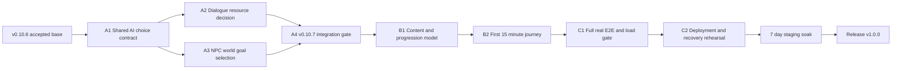

# v0.10.7 -> v1.0.0 内测交付总控执行包

**状态：** 可执行，待产品负责人确认后进入开发

**基线：** `v0.10.6`，commit `48377ae`

**目标：** 交付第一个可向 10-30 名朋友发放激活码、无需开发者持续盯守、且能明确体现“AI 在世界中行动”的 `v1.0.0`。

**技术栈：** TypeScript、pnpm monorepo、Fastify、PostgreSQL/Drizzle、React/Vite、Vitest、Playwright、DeepSeek 与模板 fallback。

---

## 1. 第一性原则与不可变约束

### 1.1 最终业务目标

`v1.0.0` 不是“已有 Demo 改版本号”，而是一个小规模但完整的封闭内测产品：

- 新玩家不需要口头指导即可完成注册、建角、探索、战斗、掉落、装备与回城处理；
- NPC 在玩家离线时仍根据现实时间、需求和经济状态持续生活；
- 玩家至少能观察到一个 AI 决策确实改变 NPC 后续行为的闭环；
- 资产、经济、任务和角色状态仍由规则与数据库事务最终裁决；
- 服务在 10 名并发玩家和 7 天持续运行下无需人工救火。

### 1.2 AI 权限边界

现有“AI 只能生成文本”约束在 `v0.10.7` 被精确定义为：

> AI 可以生成表现文本，也可以从规则层提供的有限合法候选中选择一个结构化意图；AI 永远不能自行构造资产、数量、价格、奖励、坐标或数据库写入。服务端必须在执行前基于最新状态重新校验。

因此以下约束保持不变：

- `mutatesWorldState` 永远为 `false`；
- AI 调用不得发生在数据库事务内；
- AI 输出只包含候选 ID 和有长度限制的理由，不接受自由形式动作参数；
- 模型失败、超时、预算熔断、非法输出时必须走确定性模板 fallback；
- 所有资产变动继续走现有事务、条件更新、`ItemService` 和账本路径；
- AI 的选择可以被规则拒绝，不能通过“高好感”绕过 NPC 实际库存和生存保留量。

### 1.3 范围边界

本交付包不包含：

- 副本、多房间 Boss、共享野外、玩家交易、公会、PVP、组队；
- WebSocket、完整手机端、生活职业完整系统、天气引擎；
- 扩大到 50-100 个 NPC；
- 为了“通用”而新增第二套调度器、第二套资产服务或通用工作流引擎。

天气作为未来 `worldSignals` 输入保留接口，本版不伪造一个没有完整状态与迁移逻辑的天气系统。

## 2. 输入文档

- 产品总设计：`docs/superpowers/specs/2026-07-01-ai-mud-game-design.md`
- 路线图：`docs/superpowers/plans/2026-07-02-v0.8-v1.0-closed-beta-roadmap.md`
- HUD 设计：`docs/superpowers/specs/2026-07-02-v0.8-client-hud-interaction-design.md`
- 最近验收：`docs/reviews/2026-07-12-v0.10.5-product-code-acceptance-report.md`
- 当前发布说明：`docs/releases/v0.10.6.md`
- Package A：`docs/superpowers/plans/2026-07-29-v0.10.7-ai-native-npc-intent-execution-pack.md`
- Package B：`docs/superpowers/plans/2026-07-29-v1.0-product-closure-execution-pack.md`
- Package C：`docs/superpowers/plans/2026-07-29-v1.0-release-readiness-execution-pack.md`

## 3. 工作包拆分

| 工作包 | 产品结果 | 主要代码所有权 | 预计工程时间 |
| --- | --- | --- | --- |
| A `v0.10.7` AI 原生 NPC 意图 | NPC 会在合法候选中作出可观察选择；索要物资不再由固定阈值自动决定 | `game-rules`、`ai-prompts`、server AI/NPC/dialogue/world-runtime、shared/admin | 5-7 个工程日 |
| B `v1.0` 产品收口 | 两张野图、四槽装备、10 级毕业线与首 15 分钟新手闭环成立 | `content`、掉落/成长规则、GameService、HUD/tutorial | 4-6 个工程日 |
| C `v1.0` 发布就绪 | 完整真实 E2E、10 并发基线、部署备份、运营材料和 7 天预发证据齐全 | scripts、E2E、部署文档/制品、发布文档 | 3-4 个工程日 + 7 天自然观察 |

总预算：12-17 个工程日，最短约 3 周自然时间。7 天预发观察是墙上时间，不以加速模拟替代。

## 4. 依赖关系



Package A 内部可以先分别实现对话决策和世界目标，但两者共享 prompt/parser、版本和迁移，默认由单一执行流顺序完成，禁止在同一工作树并行写入。

## 5. Canonical 路径

- 世界事实与数值：`packages/content` + `packages/game-rules`。
- AI 输入输出契约：`packages/ai-prompts`。
- 跨端 DTO 与版本：`packages/shared`。
- 世界推进：现有 `WorldRuntimeService` + `WorldPostTickService`，不新增第二个 scheduler。
- NPC 执行：现有 `NpcService` / `npc_actions`；长期目标只作为其输入，不另造一套行动系统。
- 资产：现有 `ItemService`、市场事务路径与铜币/物品账本。
- 客户端同步：唯一 `/game/sync` + 单轮询器。
- 发布版本：`packages/shared/src/version.ts`，根 `package.json` 的旧版本不作为事实来源。

## 6. 版本与迁移纪律

- 新分支从 `48377ae` 建立，推荐：`codex/v1.0-delivery`。
- Package A 开发期间保持 `PRODUCT_VERSION="0.10.6"`；A 全部门禁通过后一次性发布 `0.10.7`。
- Package B/C 开发期间保持 `PRODUCT_VERSION="0.10.7"`；不使用 `1.0.0-rc.x` 作为数据库世界版本。
- 只有所有发码门禁通过后，最终提交才改为 `PRODUCT_VERSION="1.0.0"`。
- 下一迁移编号从 `0026` 开始；每次新增迁移同时更新 SQL、`_journal.json`、`schema.ts`、迁移验证和 `schemaVersion`。
- 新 AI purpose 或 prompt 修改必须 bump `promptVersion`；共享 DTO bump `apiVersion`；NPC/成长规则语义 bump `rulesetVersion`；内容数据 bump `contentVersion`。
- 不为文档、CSS 或测试 fixture 单独 bump 兼容版本。

## 7. 执行方式与汇报节奏

- 默认单代理、单工作树、顺序执行；共享状态和共享迁移禁止并行。
- 每个工作包开始前做一次逻辑自审，结束时做一次独立验收；候选代码未变化时不重复同一全量门禁。
- 每个任务一个聚焦 commit；提交标题沿用英文祈使句，并附：

```text
Constraint: <本提交保护的外部约束>
Rejected: <考虑过的替代方案> | <拒绝原因>
Confidence: high|medium|low
```

- 除阻断、范围翻倍或需要产品决策外，不在每个微步骤暂停；以工作包为单位连续完成实现、测试和提交。
- 任一工作包预计文件数或耗时超过本计划 2 倍，停止扩张并重新评估，不通过临时兼容层掩盖设计失控。

## 8. 总控执行步骤

### 任务 0：冻结基线

- [ ] 记录 `git status --short --branch`、`git rev-parse HEAD` 和兼容版本。
- [ ] 从 `48377ae` 创建干净 worktree/分支。
- [ ] 运行聚焦基线：shared、game-rules、ai-prompts、server AI/NPC/dialogue、web tutorial。
- [ ] 确认 `.env` 中 DeepSeek Key 只做“是否存在”检查，禁止打印密钥。

### 任务 1：执行 Package A

- [ ] 按 Package A 顺序完成共享候选选择契约。
- [ ] 完成对话资源请求 AI 决策并关闭 P1-4。
- [ ] 完成 NPC 世界目标选择、需求任务桥接和玩家可观察反馈。
- [ ] 真实 DeepSeek 与模板 fallback 各验收一次。
- [ ] 7 天模板仿真仍满足经济与账本门禁。
- [ ] 发布 `v0.10.7` 中文说明并提交。

Package A 门禁：

```bash
CI=true pnpm --filter @ai-mud/game-rules test
CI=true pnpm --filter @ai-mud/ai-prompts test
CI=true pnpm --filter @ai-mud/server test -- ai dialogue npc npc-task world-runtime
pnpm test:postgres
pnpm verify:npc-simulation
pnpm verify:ai-intent
git diff --check
```

### 任务 2：执行 Package B

- [ ] 用实际规则建立可重复的内容毕业线模拟，不先拍脑袋调掉率。
- [ ] 补齐四槽装备和两张野图的有效掉落来源。
- [ ] 完成 10 级内测成长曲线、首件掉落保障与 15 分钟新手引导。
- [ ] 在 1440x900、1180x900、980x900、390x844 做视觉与交互验收。
- [ ] 记录三组数值候选及最终选择依据。

Package B 门禁：

```bash
CI=true pnpm --filter @ai-mud/content test
CI=true pnpm --filter @ai-mud/game-rules test
CI=true pnpm --filter @ai-mud/server test -- game item
CI=true pnpm --filter @ai-mud/web test
pnpm verify:content-progression
pnpm --filter @ai-mud/web e2e
git diff --check
```

### 任务 3：执行 Package C 的发布前工程

- [ ] 将真实 E2E 扩展到完整玩家与运营链路。
- [ ] 实现无第三方依赖的 10 客户端负载脚本，先跑 2 分钟 smoke，再跑 1 小时正式基线。
- [ ] 形成可迁移到真实服务器的生产构建、环境变量、迁移、备份和恢复流程。
- [ ] 准备批量激活码、公告、已知问题、反馈模板和指标口径。
- [ ] 在隔离预发数据库完成一次世界重置和一次备份恢复演练。

### 任务 4：冻结 `v1.0.0` 候选

- [ ] 冻结候选 commit；冻结后只接受阻断级修复。
- [ ] 对冻结 bytes 运行一次全量门禁：

```bash
CI=true pnpm -r test
CI=true pnpm -r typecheck
CI=true pnpm -r lint
CI=true pnpm -r build
pnpm db:verify-migrations
pnpm test:postgres
pnpm db:verify-world-reset
pnpm verify:npc-simulation
pnpm verify:ai-intent
pnpm verify:content-progression
pnpm verify:load -- --clients=10 --duration=60m
pnpm --filter @ai-mud/web e2e
git diff --check
```

- [ ] 任何命令失败都回到责任包修复；修复后生成新的候选 commit，旧候选作废。

### 任务 5：7 天预发持续运行

- [ ] 在目标服务器或等价预发主机部署冻结候选，使用独立数据库和生产式环境变量。
- [ ] 启用真实 world tick、AI 日预算和每日备份。
- [ ] 自动每小时采样健康、world runtime lag、AI 预算、错误、账本、经济和 NPC 活性。
- [ ] 连续 7 天不手工改库、不人工补资源、不重启“解决”逻辑问题。
- [ ] 若发生部署平台维护等外部中断，记录并重启观察窗口；不得把中断时间算作通过。

7 天通过标准：

```text
world runtime lag < 2 ticks after catch-up
uncaught/server 5xx = 0
asset ledger drift = 0
negative balances/inventory = 0
starving NPC = 0
NPC all-window idle rate < 30%
market transactions/day > 0
AI budget never exceeds configured hard limit
template fallback keeps world progressing during forced provider outage
daily backup exists and one restore copy has been opened successfully
```

### 任务 6：正式发布 `v1.0.0`

- [ ] 用 3 个全新账号做无口头指导的新手验收；至少 2/3 在 15 分钟内获得并查看第一件掉落装备。
- [ ] 产品负责人确认已知问题、反馈渠道和首批激活码数量。
- [ ] 将 `PRODUCT_VERSION` 设置为 `1.0.0`，只使用已经验收确定的兼容版本。
- [ ] 新建 `docs/releases/v1.0.0.md`，附实际门禁输出和 7 天观察区间。
- [ ] 更新路线图所有门禁；没有证据的复选框不得勾选。
- [ ] 创建最终发布 commit/tag；没有远端时明确记录“本地已发布，未推送”。

## 9. v1.0 发码证据矩阵

| 门禁 | 责任包 | 必须保留的证据 |
| --- | --- | --- |
| 注册到首件掉落装备 <= 15 分钟 | B/C | 真实 E2E + 3 个新账号人工计时 |
| 7 天世界稳定 | C | 加速模拟报告 + 预发连续采样报告 |
| AI 原生闭环 | A | DeepSeek 与 fallback 两条真实结果、决策审计、资产不变量 |
| 经济活性与守恒 | A/C | 7 天模拟、账本检查、预发日报 |
| 大厅 10 并发 | C | 1 小时负载报告及 p50/p95/错误率 |
| 完整玩家链路 | C | 非 mock Playwright 报告 |
| 管理端运营 | C | 禁用/恢复、激活码作废、公告、重置的实弹记录 |
| 内容毕业线 | B | 使用实际规则的种子模拟报告与最终参数版本 |
| 部署与恢复 | C | 构建产物、环境清单、备份及恢复校验 |

## 10. 停止条件

出现以下任一情况立即停止集成，不得靠放宽门禁继续：

- AI 输出中的自由文本或数值直接进入资产/行动写路径；
- AI/network 调用位于数据库事务中；
- 同一触发窗口重复创建目标、任务或资产；
- template fallback 无法让世界继续运行；
- 内容毕业线只能靠增加大量新地图才能达成；
- 为新目标新增第二套世界 tick、行动状态机、库存或账本；
- 真实 E2E 被 mock 替换来“修绿”；
- 10 并发出现资产重复、负库存、world tick 长时间滞后或持续 5xx；
- 7 天观察期间需要人工改库、补钱、补资源或重置世界；
- 最终候选在验收过程中继续变化却仍沿用旧报告。

## 11. 外部依赖与授权边界

以下事项在最终发布前需要产品负责人提供或确认，但不阻塞本地 Package A/B 开发：

- 可访问的预发/正式服务器、域名与 HTTPS 终止方式；
- 服务器侧 PostgreSQL 与备份存储位置；
- DeepSeek 账号预算上限，Key 继续只放 secret/env；
- 首批内测人数与反馈群；
- 7 天预发窗口开始时间。

未取得这些外部条件时，可以交付“本地冻结候选”，但不得宣称 `v1.0.0` 已可对外发码。

## 12. 规划自审结论

本执行包在产品和工程上没有发现需要先向产品负责人追问才能开始的内部逻辑阻断，关键取舍如下：

- **没有直接把 v0.10.6 改号为 v1.0**：当前可靠性底座已成立，但 AI 行为、内容毕业线和真实运行证据尚未成立。
- **没有让 AI 直接生成 action payload**：封闭候选选择已经能产生差异化，又不会破坏资产、事务和可回放性。
- **没有只做 NPC 赠予**：赠予关闭 P1-4，世界目标选择才满足“AI 在世界中生活”的产品主张，两者缺一不可。
- **没有把天气和副本塞进 v1.0**：现有时间、库存、市场、职业和记忆足以验证第一条 AI 原生闭环；新增天气/副本会推迟最关键假设的验证。
- **没有新增第二套 NPC 行动状态机**：current goal 只为现有逐格行动提供持续目标，执行事实仍归 `npc_actions`。
- **没有采用 `1.0.0-rc.x` 作为世界版本**：候选阶段保持 `0.10.7`，避免未发布候选引入额外世界兼容分支；全部门禁通过后一次 bump 到 `1.0.0`。
- **没有用更多地图解决内容量**：先通过四槽、词缀、头目独占和实际模拟增加深度，符合小规模内测目标。
- **没有重复全量验证**：每包使用聚焦门禁，冻结候选只执行一次完整终审；真实 provider、1 小时负载和 7 天观察只对不再变化的候选运行。

剩余不确定性均属于真实验证结果，而非未定义方案：AI 会如何选择、最终掉率应取哪组、目标主机性能和真人新手耗时，必须由对应门禁给出证据，不能在规划阶段伪造答案。
